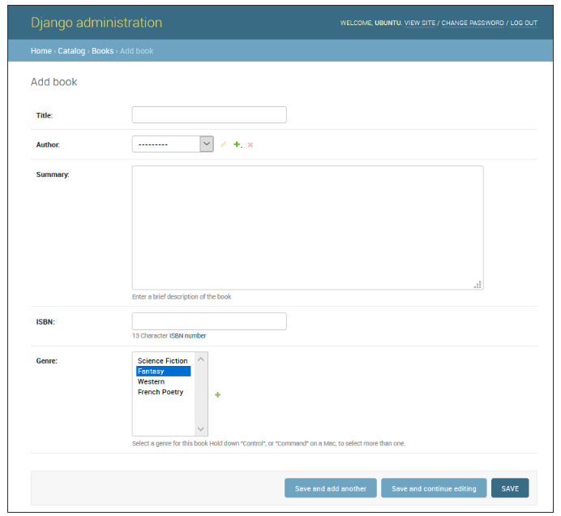
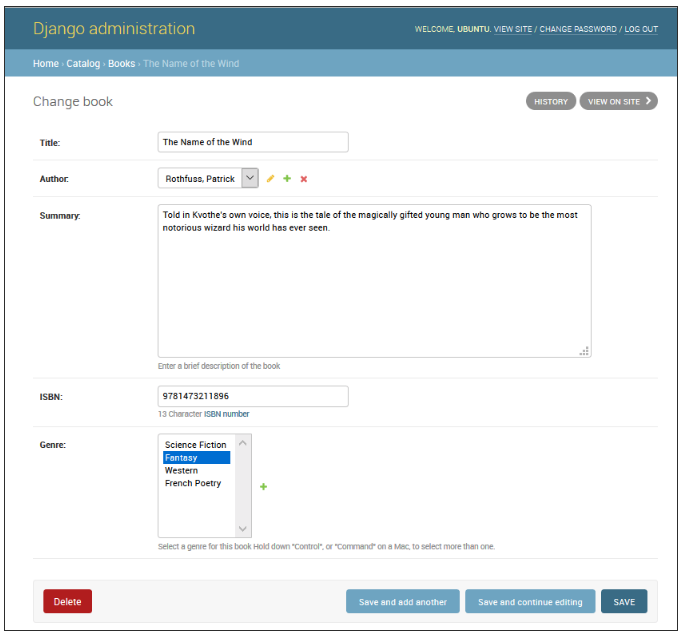
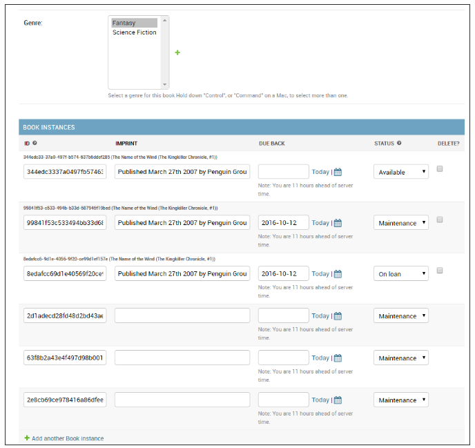

<!-- $theme: gaia -->

[Django Tutorial Part 4: Django admin site](https://github.com/YoonJoon/AboutDjango/blob/master/adminSite.md)
=================================

<br>

##### Created by [이 윤 준](https://www.facebook.com/yoonjoon.lee) (yoonjoon.lee@gmail.com)

May, 2019

---

We've created models for the LocalLibrary website, we'll use the Django Admin site to add some "real" book data.

We'll show you 

- how to register the models with the admin site, 
- how to login and create some data. 
- some of the ways you can further improve the presentation of the Admin site.

---

### Overview

<br>

The Django admin <i>application</i> can use your models to automatically build a site area that you can use to create, view, update, and delete records.

This can save you a lot of time during development, making it very easy to test your models and get a feel for whether you have the <i>right</i> data. 

The admin application can also be useful for managing data in production, depending on the type of website. 

---

The Django project recommends it only for internal data management, as the model-centric approach is not necessarily the best possible interface for all users, and exposes a lot of unnecessary detail about the models.

All the configuration required was done automatically when we created the skeleton project. 

As a result, all you <b>must</b> do to add your models to the admin application is to register them.

At the end, we'll provide a brief demonstration of how we might further configure the admin area to better display our model data.

---

After registering the models we'll show how to create a new "superuser", login to the site, and create some books, authors, book instances, and genres

---

### Registering models

<br>

Open <b>admin.py</b> in the catalog application (<b>/locallibrary/catalog/admin.py</b>).

```python
from django.contrib import admin

# Register your models here.
```

---

Register the models. This code simply imports the models and then calls <code>admin.site.register</code> to register each of them.

```python
from catalog.models import Author, Genre, Book, BookInstance

admin.site.register(Book)
admin.site.register(Author)
admin.site.register(Genre)
admin.site.register(BookInstance)
```

This is the simplest way of registering a model, or models, with the site.

---

### Creating a superuser

<br>

In order to log into the admin site, we need a user account with Staff status enabled. 

In order to view and create records we also need this user to have permissions to manage all our objects.  

We can create a "superuser" account that has full access to the site and all needed permissions using <b>manage.py</b>.


```python
python3 manage.py createsuperuser
```

---

Now restart the development server so we can test the login:

```python
python3 manage.py runserver
```

---

### Logging in and using the site

<br>

To login to the site, open the /admin URL (e.g. http://127.0.0.1:8000/admin) and enter your new superuser userid and password credentials.

This part of the site displays all our models, grouped by installed application. 

We can click on a model name to go to a screen that lists all its associated records, and We can further click on those records to edit them. 

---

You can also directly click the <b>Add</b> link next to each model to start creating a record of that type.


---

Click on the <b>Add</b> link to the right of <i>Books</i> to create a new book. 




---


Enter values for the fields. We can create new authors or genres by pressing the + button next to the respective fields. When we're done we can press <b>SAVE</b>, <b>Save and add another</b>, or <b>Save and continue editing</b> to save the record.

---

When we've finished adding books, click on the Home link in the top bookmark to be taken back to the main admin page. 

Then click on the Books link to display the current list of books.

The title of each book is displayed; this is the value returned in the Book model's <code>\_\_str\_\_()</code> method that we specified in the last article.

---


---

From this list we can delete books by selecting the checkbox next to the book, selecting the <i>delete...</i> action from the <i>Action</i> drop-down list, and then pressing the <b>Go</b> button. We can also add new books by pressing the <b>ADD BOOK</b> button. 

We can edit a book by selecting its name in the link. The edit page for a book, is almost identical to the "Add" page. The main differences are the page title (<i>Change book</i>) and the addition of <b>Delete</b>, <b>HISTORY</b> and <b>VIEW ON SITE</b> buttons (this last button appears because we defined the <code>get\_absolute\_url()</code> method in our model).

---



---

Now navigate back to the Home page (using the Home link the breadcrumb trail) and then view the Author and Genre lists.

What we won't have is any <i>Book Instances</i>, because these are not created from Books (although we can create a <code>Book</code> from a <code>BookInstance</code> — this is the nature of the ForeignKey field). 

Navigate back to the <i>Home</i> page and press the associated <b>Add</b> button to display the <i>Add book instance</i>. Note the large, globally unique Id, which can be used to separately identify a single copy of a book in the library.

---


---

### Advanced configuration

Django does a pretty good job of creating a basic admin site using the information from the registered models:

- Each model has a list of individual records, identified by the string created with the model's <code>__str__()</code> method, and linked to detail views/forms for editing. By default, this view has an action menu at the top that we can use to perform bulk delete operations on records.

- The model detail record forms for editing and adding records contain all the fields in the model, laid out vertically in their declaration order.

---

We can further customise the interface to make it even easier to use.

- List views: 
	- Add additional fields/information displayed for each record. 
	- Add filters to select which records are listed, based on date or some other selection value.
	- Add additional options to the actions menu in list views and choose where this menu is displayed on the form.

---

- Detail views
	- Choose which fields to display (or exclude), along with their order, grouping, whether they are editable, the widget used, orientation etc.
	- Add related fields to a record to allow inline editing (e.g. add the ability to add and edit book records while you're creating their author record).

---

We're going to look at a few changes that will improve the interface for our LocalLibrary, including adding more information to <code>Book</code> and <code>Author</code> model lists, and improving the layout of their edit views. We won't change the <code>Language</code> and <code>Genre</code> model presentation.

---

#### Register a ModelAdmin class

To change how a model is displayed in the admin interface you define a ModelAdmin class (which describes the layout) and register it with the model.

Let's start with the <code>Author</code> model. Open <b>admin.py</b> in the catalog application (<b>/locallibrary/catalog/admin.py</b>). Comment out your original registration (prefix it with a #) for the Author model:

```python
# admin.site.register(Author)
```

---

Add a new <code>AuthorAdmin</code> and registration.

```python
# Define the admin class
class AuthorAdmin(admin.ModelAdmin):
    pass

# Register the admin class with the associated model
admin.site.register(Author, AuthorAdmin)
```

We'll add <code>ModelAdmin</code> classes for <code>Book</code>, and <code>BookInstance</code>. We again need to comment out the original registrations:

```python
# admin.site.register(Book)
# admin.site.register(BookInstance)
```

---

To create and register the new models, We'll instead use the <code>@register</code> decorator to register the models:

```python
# Register the Admin classes for Book using the decorator
@admin.register(Book)
class BookAdmin(admin.ModelAdmin):
    pass

# Register the Admin classes for BookInstance using the decorator
@admin.register(BookInstance) 
class BookInstanceAdmin(admin.ModelAdmin):
    pass
```

Currently all of our admin classes are empty (see pass) so the admin behaviour will be unchanged!

---

#### Configure list views

The <i>LocalLibrary</i> currently lists all authors using the object name generated from the model <code>\_\_str\_\_()</code> method. This is fine when there are a few authors, but once many we may end up having duplicates. To differentiate them, or just because we want to show more interesting information about each author, we can use list_display to add additional fields to the view.

---

Replace our <code>AuthorAdmin</code> class. The field names to be displayed in the list are declared in a <i>tuple</i> in the required order.

```python
class AuthorAdmin(admin.ModelAdmin):
    list_display = ('last_name', 'first_name', 'date_of_birth', 'date_of_death')
```

Now navigate to the author list. The fields above should now be displayed,


---

Unfortunately we can't directly specify the genre field in <code>list_display</code> because it is a <code>ManyToManyField</code>. Instead we'll define a <code>display_genre</code> function to get the information as a string.

Add the code into our <code>Book</code> model (<b>models.py</b>). This creates a string from the first three values of the <code>genre</code> field (if they exist) and creates a <code>short_description</code> that can be used in the admin site for this method.

---

```python
    def display_genre(self):
        """Create a string for the Genre. This is 
           required to display genre in Admin."""
        return ', '.join(genre.name 
            for genre in self.genre.all()[:3])
    
    display_genre.short_description = 'Genre'
```

---

After saving the model and updated admin, open your website and go to the Books list page;


The <code>Genre</code> model (and the <code>Language</code> model, if we defined one) both have a single field, so there is no point creating an additional model for them to display additional fields.

---

#### Add list filters

Once we've got a lot of items in a list, it can be useful to be able to filter which items are displayed. This is done by listing fields in the <code>list_filter</code> attribute. Replace our current <code>BookInstanceAdmin</code> class with the code fragment below.

```python
class BookInstanceAdmin(admin.ModelAdmin):
    list_filter = ('status', 'due_back')
```

The list view will now include a filter box to the right. Note how we can choose dates and status to filter the values:

---


---

#### Organise detail view layout

By default, the detail views lay out all fields vertically, in their order of declaration in the model. We can change 

- the order of declaration, which fields are displayed (or excluded), 
- whether sections are used to organise the information, 
- whether fields are displayed horizontally or vertically, and 
- even what edit widgets are used in the admin forms.

---

##### Controlling which fields are displayed and laid out

Update our <code>AuthorAdmin</code> class to add the fields line:

```python
class AuthorAdmin(admin.ModelAdmin):
    list_display = ('last_name', 'first_name', 
                    'date_of_birth', 'date_of_death')
    fields = ['first_name', 'last_name', 
              ('date_of_birth', 'date_of_death')]
```

The <code>fields</code> attribute lists just those fields that are to be displayed on the form, in order. Fields are displayed vertically by default, but will display horizontally if you further group them in a tuple (as shown in the "date" fields above).

---

In your website go to the author detail view.


---

##### Sectioning the detail view

We can add "sections" to group related model information within the detail form, using the fieldsets attribute.

In the <code>BookInstance</code> model we have information related to what the book is (i.e. <code>name</code>, <code>imprint</code>, and <code>id</code>) and when it will be available (<code>status</code>, <code>due_back</code>). We can add these in different sections by adding the text in bold to our <code>BookInstanceAdmin</code> class.

---

```python
@admin.register(BookInstance)
class BookInstanceAdmin(admin.ModelAdmin):
    list_filter = ('status', 'due_back')
    
    fieldsets = (
        (None, {
            'fields': ('book', 'imprint', 'id')
        }),
        ('Availability', {
            'fields': ('status', 'due_back')
        }),
    )
```

Each section has its own title (or None, if you don't want a title) and an associated tuple of fields in a dictionary.

---

Now navigate to a book instance view in your website.


---

##### Inline editing of associated records

Sometimes it can make sense to be able to add associated records at the same time. 

We can do this by declaring inlines, of type TabularInline (horizonal layout) or StackedInline (vertical layout, just like the default model layout). We can add the <code>BookInstance</code> information inline to our <code>Book</code> detail.

---

```python
class BooksInstanceInline(admin.TabularInline):
    model = BookInstance

@admin.register(Book)
class BookAdmin(admin.ModelAdmin):
    list_display = ('title', 'author', 'display_genre')
    inlines = [BooksInstanceInline]
```

---

Now navigate to a view for a Book in your website.



---

all we've done is declare our tabular inline class, which just adds all fields from the inlined model. We can specify all sorts of additional information for the layout, including the fields to display, their order, whether they are read only or not, etc.

---

### Challenge yourself

It is time for you to try a few things.

1. For the BookInstance list view, add code to display the book, status, due back date, and id (rather than the default <code>\_\_str\_\_()</code> text).
2. Add an inline listing of <code>Book</code> items to the <code>Author</code> detail view using the same approach as we did for <code>Book/BookInstance</code>.


