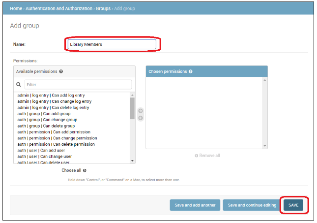
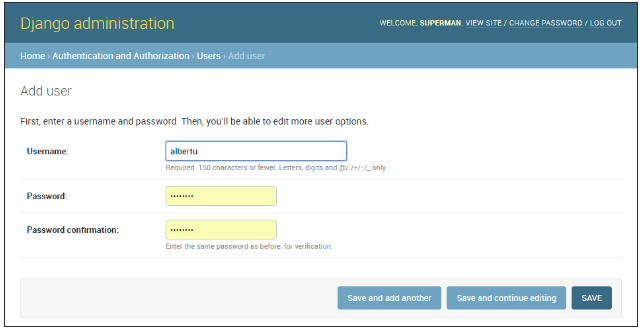

<!-- $theme: gaia -->

[Django Tutorial Part 8: User authentication and permissions](https://github.com/YoonJoon/AboutDjango/blob/master/authentication.md)
=================================

<br>

##### Created by [이 윤 준](https://www.facebook.com/yoonjoon.lee) (yoonjoon.lee@gmail.com)

June, 2019

---

We'll show 

- how to allow users to log in to our site with their own accounts, and 
- how to control what they can do and see based on whether or not they are logged in and their <i>permissions</i>. 

We'll extend the <i>LocalLibrary</i> website, adding login and logout pages, and user- and staff-specific pages for viewing books that have been borrowed.

---

### Overview

<br>

Django provides an authentication and authorization ("permission") system, built on top of the session framework, that allows us to verify user credentials and define what actions each user is allowed to perform. The framework includes built-in models for <code>Users</code> and <code>Groups</code> (a generic way of applying permissions to more than one user at a time), permissions/flags that designate whether a user may perform a task, forms and views for logging in users, and view tools for restricting content.

---

We'll show how to 

- enable user authentication in the <i>LocalLibrary</i> website, 
- create our own login and logout pages, 
- add permissions to our models, and 
- control access to pages. 

We'll use the authentication/permissions to display lists of books that have been borrowed for both users and librarians.

---

The authentication system is very flexible, and we can build up our URLs, forms, views, and templates from scratch, just calling the provided API to log in the user. However, we're going to use Django's "stock" authentication views and forms for our login and logout pages. We'll still need to create some templates, but that's pretty easy.

We'll also show how to create permissions, and check on login status and permissions in both views and templates.

---

### Enabling authentication

<br>

The authentication was enabled automatically when we created the skeleton website so we don't need to do anything more at this point.

The configuration is set up in the <code>INSTALLED_APPS</code> and <code>MIDDLEWARE</code> sections of the project file (<b>locallibrary/locallibrary/settings.py</b>):

---
<font size="6">

```python
INSTALLED_APPS = [
    ...
    # Core authentication framework and its default models.
    'django.contrib.auth',  
    # Django content type system 
    # (allows permissions to be associated with models).
    'django.contrib.contenttypes',  
    ....

MIDDLEWARE = [
    ...
    #Manages sessions across requests
    'django.contrib.sessions.middleware.SessionMiddleware',  
    ...
     #Associates users with requests using sessions.
    'django.contrib.auth.middleware.AuthenticationMiddleware', 
    ....
```
</font>

---

### Creating users and groups

<br>

We already created our first user when we looked at the Django admin site (this was a superuser, created with the command <code>python manage.py createsuperuser</code>). Our superuser is already authenticated and has all permissions, so we'll need to create a test user to represent a normal site user. We'll be using the admin site to create our locallibrary groups and website logins.

---

We'll first create a group and then a user. Even though we don't have any permissions to add for our library members yet, it will be much easier to add them once to the group than individually to each member.

Start the development server and navigate to the admin site in your local web browser (http://127.0.0.1:8000/admin/). Login to the site using the credentials for your superuser account. 

The top level of the Admin site displays all of your models, sorted by "Django application". From the <b>Authentication and Authorisation</b> section, you can click the <b>Users</b> or <b>Groups</b> links to see their existing records.

---


---

<font size="6">
First lets create a new group for our library members.
<br>

<ol>
<font size="5">

<li>Click the <b>Add</b> button (next to Group) to create a new <i>Group</i>; enter the Name "Library Members" for the group.</li>



<li>We don't need any permissions for the group, so just press <b>SAVE</b> (you will be taken to a list of groups).</li>
</font>
</ol>

---

<font size="6">
Now let's create a user
<br>

<ol>
<font size="5">

<li>Navigate back to the home page of the admin site</li>
<li>Click the <b>Add</b> button next to <i>Users</i> to open the <i>Add user</i> dialogue.</li>



<li>Enter an appropriate <b>Username</b> and <b>Password/Password confirmation</b> for your test user</li>
</ol>

---

<ol start="4">
<li> <p>Press <b>SAVE</b> to create the user. </p>

<p>The admin site will create the new user and immediately take you to a Change user screen where you can change your username and add information for the User model's optional fields. These fields include the first name, last name, email address, and the user's status and permissions (only the Active flag should be set). Further down you can specify the user's groups and permissions, and see important dates related to the user (e.g. their join date and last login date).</p></li>
</ol>

---


---

<ol start="5">
<li>In the <i>Groups</i> section, select <b>Library Member</b> group from the list of <i>Available groups</i>, and then press the <b>right-arrow</b> between the boxes to move it into the <i>Chosen groups</i> box.</li>


<li>We don't need to do anything else here, so just select <b>SAVE</b> again, to go to the list of users.</li>
</ol>
</font>

Now you have a "normal library member" account that you will be able to use for testing.

---

### Setting up your authentication views

<br>

Django provides almost everything we need to create authentication pages to handle login, log out, and password management "out of the box". This includes a URL mapper, views and forms, but it does not include the templates — we have to create our own!

We show how to integrate the default system into the <i>LocalLibrary</i> website and create the templates. We'll put them in the main project URLs.

---

#### Project URLs

Add the following to the bottom of the project urls.py file (<b>locallibrary/locallibrary/urls.py</b>):

<font size="6">

```python
# Add Django site authentication urls
# (for login, logout, password management)
urlpatterns += [
    path('accounts/', include('django.contrib.auth.urls')),
]
```
</font>

Navigate to the http://127.0.0.1:8000/accounts/ URL and Django will show an error that it could not find this URL, and listing all the URLs it tried. From this we can see the URLs that will work, for example:

---

Now try to navigate to the login URL (http://127.0.0.1:8000/accounts/login/). This will fail again, but with an error that tells that we're missing the required template (registration/login.html) on the template search path. We'll see the following lines listed in the yellow section up the top:

<font size="6">

```python
Exception Type:    TemplateDoesNotExist
Exception Value:    registration/login.html
```
</font>

The next step is to create a registration directory on the search path and then add the <b>login.html</b> file.

---

#### Template directory

The URLs (and implicitly views) that we just added expect to find their associated templates in a directory <b>/registration/</b> somewhere in the templates search path.

For this site, we'll put our HTML pages in the <b>templates/registration/</b> directory. This directory should be in your project root directory, i.e the same directory as the catalog and locallibrary folders). Create these folders now.

---

To make these directories visible to the template loader (i.e. to put this directory in the template search path) open the project settings (<b>/locallibrary/locallibrary/settings.py</b>), and update the <code>TEMPLATES</code> section's <code>'DIRS'</code> line.

<font size="6">

```python
    TEMPLATES = [
    {
        ...
        'DIRS': [os.path.join(BASE_DIR, 'templates')],
        'APP_DIRS': True,
        ...
```
</font>

---

#### Login template

Create a new HTML file called <b>/locallibrary/templates/registration/login.html</b> with the contents: 

---

<font size="6">

```html





  <p>Your username and password didn't match. 
    Please try again.</p>



  
    <p>Your account doesn't have access to this page. 
      To proceed, please login with an account 
      that has access.</p>
  
    <p>Please login to see this page.</p>
  

```

---

```html
<form method="post" action="">

<table>

<tr>
  <td>{{ form.username.label_tag }}</td>
  <td>{{ form.username }}</td>
</tr>

<tr>
  <td>{{ form.password.label_tag }}</td>
  <td>{{ form.password }}</td>
</tr>
</table>

<input type="submit" value="login" />
<input type="hidden" name="next" value="{{ next }}" />
</form>

{# Assumes you setup the password_reset view in your URLconf #}
<p><a href="">Lost password?</a></p>


```
</font>

---

This template shares some similarities with the ones we've seen before — it extends our base template and overrides the content block. The rest of the code is fairly standard form handling code, which we will discuss later. This will display a form in which you can enter your username and password, and that if you enter invalid values we will be prompted to enter correct values when the page refreshes.

---

Navigate back to the login page (http://127.0.0.1:8000/accounts/login/) once we've saved our template, and you should see something like this:


If you try to log in that will succeed and you'll be redirected to another page (by default this will be http://127.0.0.1:8000/accounts/profile/). The problem here is that, by default, Django expects that after login we will want to be taken to a profile page. As we haven't defined this page yet, we'll get another error!

---

Open the project settings (<b>/locallibrary/locallibrary/settings.py</b>) and add the text below to the bottom. Now when you log in you should be redirected to the site homepage by default.

<font size="6">

```python
# Redirect to home URL after login 
# (Default redirects to /accounts/profile/)
LOGIN_REDIRECT_URL = '/'
```
</font>

---

#### Logout template

If you navigate to the logout URL (http://127.0.0.1:8000/accounts/logout/) then you'll see some odd behaviour — our user will be logged out sure enough, but you'll be taken to the Admin logout page. That's not what we want, if only because the login link on that page takes you to the Admin login screen (and that is only available to users who have the <code>is_staff</code> permission).

---

Create and open <b>/locallibrary/templates/registration/logged_out.html</b>. Copy in the text:

<font size="6">

```html



  <p>Logged out!</p>  
  <a href="">Click here to login again.</a>

```
</font>

---

This template is very simple. It just displays a message informing you that you have been logged out, and provides a link that you can press to go back to the login screen. If you go to the logout URL again you should see this page:


---

#### Password reset templates

The default password reset system uses email to send the user a reset link. We need to create forms to get the user's email address, send the email, allow them to enter a new password, and to note when the whole process is complete.

---

##### Password reset form

This is the form used to get the user's email address (for sending the password reset email). Create <b>/locallibrary/templates/registration/password_reset_form.html</b>, and give it the contents: 

<font size="6">

```html



  <form action="" method="post">
  
  
    {{ form.email.errors }}
  
      <p>{{ form.email }}</p> 
    <input type="submit" class="btn btn-default btn-lg" value="Reset password">
  </form>

```
</font>

---

##### Password reset done

This form is displayed after your email address has been collected. Create <b>/locallibrary/templates/registration/password_reset_done.html</b>, and give it the contents: 

<font size="6">
  
```html



  <p>We've emailed you instructions for setting your password. If they haven't arrived in a few minutes, check your spam folder.</p>

```
</font>

---

##### Password reset email

This template provides the text of the HTML email containing the reset link that we will send to users. Create <b>/locallibrary/templates/registration/password_reset_email.html</b>, and give it the contents:

<font size="6">
  
```html
Someone asked for password reset for email {{ email }}. 
Follow the link below:
{{ protocol}}://{{ domain }}

```
</font>

---

##### Password reset confirm

This page is where you enter your new password after clicking the link in the password reset email. Create <b>/locallibrary/templates/registration/password_reset_confirm.html</b>, and give it the contents: 

<font size="6">

```html



    
        <p>Please enter (and confirm) your new password.</p>
        <form action="" method="post">
        
            <table>
                <tr>
                    <td>{{ form.new_password1.errors }}
                        <label for="id_new_password1">
                          New password:</label></td>
                    <td>{{ form.new_password1 }}</td>
                </tr>
```

---

```html
                <tr>
                    <td>{{ form.new_password2.errors }}
                        <label for="id_new_password2">
                          Confirm password:
                      </label></td>
                    <td>{{ form.new_password2 }}</td>
                </tr>
                <tr>
                    <td></td>
                    <td><input type="submit" 
                               value="Change my password" /></td>
                </tr>
            </table>
        </form>
    
        <h1>Password reset failed</h1>
        <p>The password reset link was invalid, 
          possibly because it has already been used. 
          Please request a new password reset.</p>
    

```
</font>

---

##### Password reset complete

This is the last password-reset template, which is displayed to notify you when the password reset has succeeded. Create <b>/locallibrary/templates/registration/password_reset_complete.html</b>, and give it the contents:

<font size="6">
  
```html



  <h1>The password has been changed!</h1>
  <p><a href="">log in again?</a></p>

```
</font>

---

#### Testing the new authentication pages

Now that we've added the URL configuration and created all these templates, the authentication pages should now just work!

We can test the new authentication pages by attempting to log in and then log out your superuser account using these URLs:

- http://127.0.0.1:8000/accounts/login/
- http://127.0.0.1:8000/accounts/logout/

---

We'll be able to test the password reset functionality from the link in the login page. <b>Be aware that Django will only send reset emails to addresses (users) that are already stored in its database!</b>

---

### Testing against authenticated users

<br>

We look at what we can do to selectively control content the user sees based on whether they are logged in or not.

---

#### Testing in templates

We can get information about the currently logged in user in templates with the <code>{{ user }}</code> template variable.

Typically we will first test against the <code>{{ user.is_authenticated }}</code> template variable to determine whether the user is eligible to see specific content. 

Next we'll update our sidebar to display a "Login" link if the user is logged out, and a "Logout" link if they are logged in.

---

Open the base template (<b>/locallibrary/catalog/templates/base_generic.html</b>) and copy the text into the <code>sidebar</code> block, immediately before the </code>endblock</code> template tag.

<font size="6">
  
```html
<ul class="sidebar-nav">

  ...

 
    <li>User: {{ user.get_username }}</li>
    <li><a href="?next={{request.path}}">
      Logout</a></li>   
 
    <li><a href="?next={{request.path}}">
      Login</a></li>   
  
</ul>
```
</font>

---

We use <code>if</code>-<code>else</code>-<code>endif</code> template tags to conditionally display text based on whether <code>{{ user.is_authenticated }}</code> is true. If the user is authenticated then we know that we have a valid user, so we call <code>{{ user.get_username }}</code> to display their name.

We create the login and logout link URLs using the url template tag and the names of the respective URL configurations. Note also how we have appended <code>?next={{request.path}}</code> to the end of the URLs. What this does is add a URL parameter next containing the address (URL) of the current page, to the end of the linked URL. After the user has successfully logged in/out, the views will use this "<code>next</code>" value to redirect the user back to the page where they first clicked the login/logout link.

---

#### Testing in views

If we're using function-based views, the easiest way to restrict access to our functions is to apply the <code>login_required</code> decorator to our view function. If the user is logged in then our view code will execute as normal. If the user is not logged in, this will redirect to the login URL defined in the project settings (<code>settings.LOGIN_URL</code>), passing the current absolute path as the <code>next</code> URL parameter. If the user succeeds in logging in then they will be returned back to this page, but this time authenticated.

<font size="6">
  
```python
from django.contrib.auth.decorators import login_required

@login_required
def my_view(request):
    ...
```
</font>

---

Similarly, the easiest way to restrict access to logged-in users in our class-based views is to derive from <code>LoginRequiredMixin</code>. We need to declare this mixin first in the superclass list, before the main view class.

<font size="6">
  
```python
from django.contrib.auth.mixins import LoginRequiredMixin

class MyView(LoginRequiredMixin, View):
    ...
```
</font>

---

This has exactly the same redirect behaviour as the <code>login_required</code> decorator. We can also specify an alternative location to redirect the user to if they are not authenticated (<code>login_url</code>), and a URL parameter name instead of "<code>next</code>" to insert the current absolute path (<code>redirect_field_name</code>).

<font size="6">
  
```python
class MyView(LoginRequiredMixin, View):
    login_url = '/login/'
    redirect_field_name = 'redirect_to'
```
</font>

---

### Example — listing the current user's books

<br>

Now that we know how to restrict a page to a particular user, let's create a view of the books that the current user has borrowed.

Unfortunately, we don't yet have any way for users to borrow books. So before we can create the book list we'll first extend the <code>BookInstance</code> model to support the concept of borrowing and use the Django Admin application to loan a number of books to our test user.

---

#### Models

First, we're going to have to make it possible for users to have a <code>BookInstance</code> on loan (we already have a <code>status</code> and a <code>due_back</code> date, but we don't yet have any association between this model and a User). We'll create one using a <code>ForeignKey</code> (one-to-many) field. We also need an easy mechanism to test whether a loaned book is overdue.

Open <b>catalog/models.py</b>, and import the <code>User</code> model from <code>django.contrib.auth.models</code>: 

<font size="6">
  
```python
from django.contrib.auth.models import User
```
</font>

---

Next, add the <code>borrower</code> field to the <code>BookInstance</code> model:

<font size="6">
  
```python
borrower = models.ForeignKey(
  User, 
  on_delete=models.SET_NULL, 
  null=True, 
  blank=True)
```
</font>

While we're here, let's add a property that we can call from our templates to tell if a particular book instance is overdue. While we could calculate this in the template itself, using a property will be much more efficient.

Add this somewhere near the top of the file: 

<font size="6">
  
```python
from datetime import date
```
</font>

---

Now add the following property definition to the <code>BookInstance</code> class:

<font size="6">
  
```python
@property
def is_overdue(self):
    if self.due_back and date.today() > self.due_back:
        return True
    return False
```
</font>

Now that we've updated our models, we'll need to make fresh migrations on the project and then apply those migrations:

<font size="6">
  
```bash
py -3 manage.py makemigrations
py -3 manage.py migrate
```
</font>

---

#### Admin

Now open <b>catalog/admin.py</b>, and add the <code>borrower</code> field to the <code>BookInstanceAdmin</code> class in both the <code>list_display</code> and the <code>fieldsets</code>. This will make the field visible in the Admin section, allowing us to assign a <code>User</code> to a <code>BookInstance</code> when needed.

---

<font size="6">
  
```python
@admin.register(BookInstance)
class BookInstanceAdmin(admin.ModelAdmin):
    list_display = ('book', 'status', 'borrower', 'due_back', 'id')
    list_filter = ('status', 'due_back')
    
    fieldsets = (
        (None, {
            'fields': ('book','imprint', 'id')
        }),
        ('Availability', {
            'fields': ('status', 'due_back','borrower')
        }),
    )
```
</font>

---

#### Loan a few book

Now that it's possible to loan books to a specific user, go and loan out a number of <code>BookInstance</code> records. Set their <code>borrowed</code> field to our test user, make the <code>status</code> "On loan", and set due dates both in the future and the past.

---

### On loan view

Now we'll add a view for getting the list of all books that have been loaned to the current user. We'll use the same generic class-based list view, but this time we'll also import and derive from <code>LoginRequiredMixin</code>, so that only a logged in user can call this view. 

We will also choose to declare a <code>template_name</code>, rather than using the default, because we may end up having a few different lists of <code>BookInstance</code> records, with different views and templates.

Add the following to catalog/views.py:

---

<font size="6">
  
```python
from django.contrib.auth.mixins import LoginRequiredMixin

class LoanedBooksByUserListView(
  LoginRequiredMixin,
  generic.ListView):
  """Generic class-based view listing books on loan 
     to current user."""
    model = BookInstance
    template_name = 
      'catalog/bookinstance_list_borrowed_user.html'
    paginate_by = 10
    
    def get_queryset(self):
        return BookInstance.objects
          .filter(borrower=self.request.user)
          .filter(status__exact='o')
          .order_by('due_back')
```
</font>

---

In order to restrict our query to just the <code>BookInstance</code> objects for the current user, we re-implement <code>get_queryset()</code>. Note that "o" is the stored code for "on loan" and we order by the <code>due_back</code> date so that the oldest items are displayed first.

---

#### URL conf for on loan books

Now open <b>/catalog/urls.py</b> and add a <code>path()</code> pointing to the above view (we can just copy the text to the end of the file).

<font size="6">
  
```python
urlpatterns += [   
    path(
      'mybooks/', 
      views.LoanedBooksByUserListView.as_view(), 
      name='my-borrowed'),
]
```
</font>

---

### Template for on-loan books

Now, all we need to do for this page is add a template. First, create the template file <b>/catalog/templates/catalog/bookinstance_list_borrowed_user.html</b> and give it the contents: 

<font size="5">
  
```html


    <h1>Borrowed books</h1>

    
    <ul>
       
      <li class="text-danger">
        <a href="">
          {{bookinst.book.title}}</a> ({{ bookinst.due_back }})        
      </li>
      
    </ul>
    
      <p>There are no books borrowed.</p>
           

```
</font>

---

This template is very similar to those we've created previously for the <code>Book</code> and <code>Author</code> objects. The only thing "new" here is that we check the method we added in the model (<code>bookinst.is_overdue</code>) and use it to change the colour of overdue items.

When the development server is running, we should now be able to view the list for a logged in user in your browser at http://127.0.0.1:8000/catalog/mybooks/. Try this out with your user logged in and logged out (in the second case, you should be redirected to the login page).

---

#### Add the list to the sidebar

The very last step is to add a link for this new page into the sidebar. We'll put this in the same section where we display other information for the logged in user.

Open the base template (<b>/locallibrary/catalog/templates/base_generic.html</b>) and add the line to the sidebar.

<font size="5">
  
```html
<ul class="sidebar-nav">
  
  <li>User: {{ user.get_username }}</li>
  <li><a href="">My Borrowed</a></li>
  <li><a href="?next={{request.path}}">Logout</a></li>   
  
  <li><a href="?next={{request.path}}">Login</a></li>   
   
</ul>
```
</font>

---

#### What does it look like?

When any user is logged in, they'll see the <i>My Borrowed</i> link in the sidebar, and the list of books displayed (the first book has no due date, which is a bug we hope to fix later!).


---

### Permissions

Permissions are associated with models and define the operations that can be performed on a model instance by a user who has the permission. By default, Django automatically gives add, change, and delete permissions to all models, which allow users with the permissions to perform the associated actions via the admin site. We can define our own permissions to models and grant them to specific users. We can also change the permissions associated with different instances of the same model.

Testing on permissions in views and templates is then very similar for testing on the authentication status.

---

#### Models

Defining permissions is done on the model "<code>class Meta</code>" section, using the permissions field. We can specify as many permissions as we need in a tuple, each permission itself being defined in a nested tuple containing the permission name and permission display value. For example, we might define a permission to allow a user to mark that a book has been returned: 

<font size="6">
  
```python
class BookInstance(models.Model):
    ...
    class Meta:
        ...
        permissions = (("can_mark_returned", 
                        "Set book as returned"),)
```
</font>

---

We could then assign the permission to a "Librarian" group in the Admin site.

Open the <b>catalog/models.py</b>, and add the permission. We will need to re-run your migrations to update the database appropriately.

---

#### Templates

The current user's permissions are stored in a template variable called <code>{{ perms }}</code>. We can check whether the current user has a particular permission using the specific variable name within the associated Django "app" — e.g. <code>{{ perms.catalog.can_mark_returned }}</code> will be <code>True</code> if the user has this permission, and <code>False</code> otherwise. We typically test for the permission using the template <code></code> tag:

<font size="6">
  
```html

    <!-- We can mark a BookInstance as returned. -->
    <!-- Perhaps add code to link to a "book return" view here. -->

```
</font>

---

#### Views

Permissions can be tested in function view using the <code>permission_required</code> decorator or in a class-based view using the <code>PermissionRequiredMixin</code>. The pattern and behaviour are the same as for login authentication, though of course, we might reasonably have to add multiple permissions.

Function view decorator:

<font size="6">
  
```python
from django.contrib.auth.decorators import permission_required

@permission_required('catalog.can_mark_returned')
@permission_required('catalog.can_edit')
def my_view(request):
    ...
```
</font>

---

A permission-required mixin for class-based views.

<font size="6">
  
```python
from django.contrib.auth.mixins import PermissionRequiredMixin

class MyView(PermissionRequiredMixin, View):
    permission_required = 'catalog.can_mark_returned'
    
    # Or multiple permissions
    permission_required = (
        'catalog.can_mark_returned', 
        'catalog.can_edit')
    # Note that 'catalog.can_edit' is just an example
    # the catalog application doesn't have such permission!
```
</font>

---

### Challenge yourself

We showed how to create a page for the current user listing the books that they have borrowed. The challenge now is to create a similar page that is only visible for librarians, that displays all books that have been borrowed, and which includes the name of each borrower.

We should be able to follow the same pattern as for the other view. The main difference is that we'll need to restrict the view to only librarians. We could do this based on whether the user is a staff member (function decorator: <code>staff_member_required</code>, template variable: <code>user.is_staff</code>).

---

When you are finished, your page should look something like the screenshot below.


