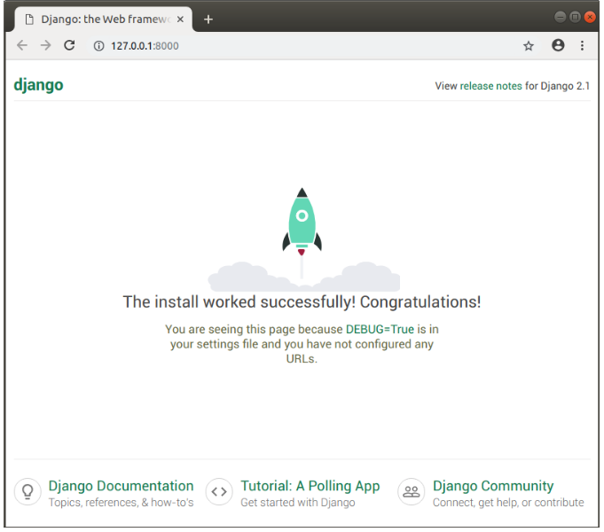

<!-- $theme: gaia -->

[Setting up a Django development environment](https://github.com/YoonJoon/AboutDjango/blob/master/developmentEnvironment.md)
=================================

<br>

##### Created by [이 윤 준](https://www.facebook.com/yoonjoon.lee) (yoonjoon.lee@gmail.com)

May, 2019

---

<br>

Show how to set up and test a Django development environment  — whatever common operating system we are using.

---

### Django development environment overview

<br>

It will be 
- explained what we get with the development environment,
- provideed an overview of some of our setup and configuration options and  
- explained how we can test it.

---

#### What is the Django development environment?

The development environment is an installation of Django on our local computer that we can use for developing and testing Django apps prior to deploying them to a production environment.

The main tools that Django itself provides are 

<font size="6">
  
- a set of Python scripts for creating and working with Django projects, 
- a simple development webserver that we can use to test local Django web applications on our computer's web browser.

</font>

---

#### What are the Django setup options?

Django is extremely flexible in terms of how and where it can be installed and configured. 

<font size="6">
  
- Installed on different operating systems.
- Installed from source, from the Python Package Index (PyPi) and in many cases from the host computer's package manager application.
- Configured to use one of several databases, which may also need to be separately installed and configured.
- Run in the main system Python environment or within separate Python virtual environments.

</font>

---

##### What operating systems are supported?

Django web applications can be run on almost any machine that can run the Python 3 programming language.

---

##### What version of Python should be used?

Python 3.5 or later can be used if needed

---

##### Where can we download Django?

- The Python Package Repository (PyPi), using the <i>pip</i> tool. This is the best way to get the latest stable version of Django.
- Use a version from your computer's package manager. 
- Install from source.

---

##### Which database?

Django supports four main databases (PostgreSQL, MySQL, Oracle, and SQLite), and there are community libraries that provide varying levels of support for other popular SQL and NoSQL databases. 

It is recommend that the same database would be chosen for both production and development.

We will be using the SQLite database, which stores its data in a file. <b>SQLite is intended for use as a lightweight database and can’t support a high level of concurrency.</b>

---

##### Installing system-wide or in a Python virtual environment?

While we can install whatever Python packages we like in the environment, we can only install one particular version of each package at a time.

Experienced Python/Django developers typically run Python apps within independent Python virtual environments. 

This enables multiple different Django environments on a single computer. The Django developer team itself recommends that <b>Python virtual environments should be used</b>.

---

### Installing Django

<br>

You call <code>workon</code> to enter it and you can use <code>pip3</code> to install Django.

```bash
pip3 install django
```
You can test that Django is installed by running the following command.

```bash
# Windows
py -3 -m django --version
```

---

### Testing your installationSection

A more interesting test is to create a skeleton project and see it working.

Create a folder for your test site and navigate into it.

```bash
mkdir django_test
cd django_test
```

---

You can then create a new skeleton site called "<i>mytestsite</i>" using the <b>django-admin</b> tool. After creating the site you can navigate into the folder where you will find the main script for managing projects, called <b>manage.py</b>.


```bash
django-admin startproject mytestsite
cd mytestsite
```

---

You can run the <i>development web server</i> from within this folder using <b>manage.py</b> and the runserver command.

<font size="6">

```python
$ python3 manage.py runserver 
Performing system checks...

System check identified no issues (0 silenced).

You have 15 unapplied migration(s). Your project may not work properly until you apply the migrations for app(s): admin, auth, contenttypes, sessions.
Run 'python manage.py migrate' to apply them.

December 16, 2018 - 07:06:30
Django version 2.1.5, using settings 'mytestsite.settings'
Starting development server at http://127.0.0.1:8000/
Quit the server with CONTROL-C.
```
</font>

---

Once the server is running you can view the site by navigating to the following URL on your local web browser: <code>http://127.0.0.1:8000/</code>.



