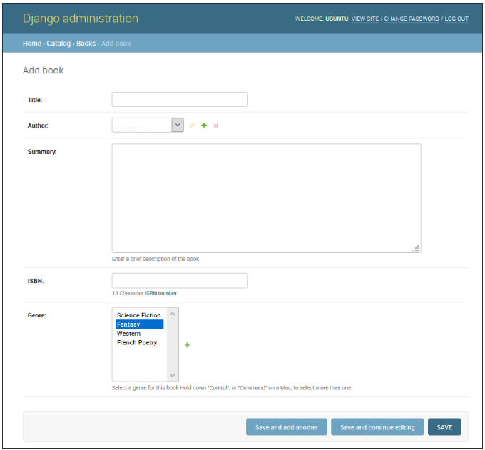

<!-- $theme: gaia -->

[Django Tutorial Part 9: Working with forms](https://github.com/YoonJoon/AboutDjango/blob/master/forms.md)
=================================

<br>

##### Created by [이 윤 준](https://www.facebook.com/yoonjoon.lee) (yoonjoon.lee@gmail.com)

June, 2019

---

We'll show 

- how to work with HTML Forms in Django, and, in particular, 
- the easiest way to write forms to create, update, and delete model instances. 

We'll extend the <i>LocalLibrary</i> website so that librarians can renew books, and create, update, and delete authors using our own forms.

---

### Overview

An HTML Form is a group of one or more fields /widgets on a web page, which can be used to collect information from users for submission to a server. Forms are a flexible mechanism for collecting user input because there are suitable widgets for entering many different types of data, including text boxes, checkboxes, radio buttons, date pickers, etc. Forms are also a relatively secure way of sharing data with the server, as they allow us to send data in <code>POST</code> requests with cross-site request forgery protection.

We've already encountered them in the Django Admin site.

---



---

Working with forms can be complicated. Developers need to 

- write HTML for the form, 
- validate and properly sanitise entered data on the server, 
- repost the form with error messages to inform users of any invalid fields, 
- handle the data when it has successfully been submitted, and 
- finally respond to the user in some way to indicate success. 

---

Django Forms take a lot of the work out of all these steps, by providing a framework that lets us define forms and their fields programmatically, and then use these objects to both generate the form HTML code and handle much of the validation and user interaction.

We're going to show 

- a few of the ways we can create and work with forms, and 
- in particular, how the generic editing form views can significantly reduce the amount of work you need to do to create forms to manipulate your models. 

---

We'll extend our <i>LocalLibrary</i> application by adding a form to allow librarians to renew library books, and we'll create pages to create, edit and delete books and authors.

---

### HTML forms

<br>

First a brief overview of HTML Forms. Consider a simple HTML form, with a single text field for entering the name of some "team", and its associated label:


---

The form is defined in HTML as a collection of elements inside <code>\<form>...\</form></code> tags, containing at least one input element of <code>type="submit"</code>.

<font size="6">

```html
<form action="/team_name_url/" method="post">
    <label for="team_name">Enter name: </label>
    <input id="team_name" type="text" 
           name="name_field" value="Default name for team.">
    <input type="submit" value="OK">
</form>
```
</font>

---

While here we just have one text field for entering the team name, a form may have any number of other input elements and their associated labels. The field's <code>type</code> attribute defines what sort of widget will be displayed. The <code>name</code> and <code>id</code> of the field are used to identify the field in JavaScript/CSS/HTML, while <code>value</code> defines the initial value for the field when it is first displayed. The matching team label is specified using the <code>label</code> tag (see "Enter name"), with a <code>for</code> field containing the <code>id</code> value of the associated </code>input.

---

The <code>submit</code> input will be displayed as a button that can be pressed by the user to upload the data in all the other input elements in the form to the server (in this case, just the <code>team_name</code>). The form attributes define the HTTP <code>method</code> used to send the data and the destination of the data on the server (<code>action</code>):

---

<font size="6">
            
- <code>action</code>: The resource/URL where data is to be sent for processing when the form is submitted. If this is not set (or set to an empty string), then the form will be submitted back to the current page URL.
- <code>method</code>: The HTTP method used to send the data: <i>post</i> or <i>get</i>.

	<font size="5">
  
	- The <code>POST</code> method should always be used if the data is going to result in a change to the server's database because this can be made more resistant to cross-site forgery request attacks.
	- The <code>GET</code> method should only be used for forms that don't change user data (e.g. a search form). It is recommended for when you want to be able to bookmark or share the URL.
	</font>

</font>

---

The role of the server is first to render the initial form state — either containing blank fields or pre-populated with initial values. 

After the user presses the submit button, the server will receive the form data with values from the web browser and must validate the information. If the form contains invalid data, the server should display the form again, this time with user-entered data in "valid" fields and messages to describe the problem for the invalid fields. 

Once the server gets a request with all valid form data, it can perform an appropriate action (e.g. saving the data, returning the result of a search, uploading a file etc.) and then notify the user.

---

As we can imagine, creating the HTML, validating the returned data, re-displaying the entered data with error reports if needed, and performing the desired operation on valid data can all take quite a lot of effort to "get right". Django makes this a lot easier, by taking away some of the heavy lifting and repetitive code.

---

### Django form handling process

Django's form handling uses all of the same techniques: 

- the view gets a request, performs any actions required including reading data from the models, 

- then generates and returns an HTML page (from a template, into which we pass a context containing the data to be displayed). 

What makes things more complicated is that the server also needs to be able to process data provided by the user, and redisplay the page if there are any errors.

---


---

Based on the diagram above, the main things that Django's form handling does are:

<font size="6">

<ol>
  <li>Display the default form the first time it is requested by the user.</li>
  
  <font size="5">
  <ul>
    <li>The form may contain blank fields (e.g. if you're creating a new record), or it may be pre-populated with initial values (e.g. if you are changing a record, or have useful default initial values).</li>
    <li>The form is referred to as unbound at this point, because it isn't associated with any user-entered data (though it may have initial values).</li>
  </ul>
  </font>
  <li>Receive data from a submit request and bind it to the form.</li>
  <font size="5">
  <ul><li>Binding data to the form means that the user-entered data and any errors are available when we need to redisplay the form.</li></ul>
  </font>
</ol>

---

<ol start = "3">
  <li>Clean and validate the data.</li>
   <font size="5">
     <ul>
       <li>Cleaning the data performs sanitization of the input (e.g. removing invalid characters that might be used to send malicious content to the server) and converts them into consistent Python types.</li>
       <li>Validation checks that the values are appropriate for the field (e.g. are in the right date range, aren't too short or too long, etc.)</li>
     </ul>
  </font>
  <li>If any data is invalid, re-display the form, this time with any user populated values and error messages for the problem fields.</li>
  <li>If all data is valid, perform required actions (e.g. save the data, send and email, return the result of a search, upload a file etc.)</li>
  <li>Once all actions are complete, redirect the user to another page.</li>
</ol>
</font>

---

Django provides a number of tools and approaches to help you with the tasks detailed above. The most fundamental is the <code>Form</code> class, which simplifies both generation of form HTML and data cleaning/validation. 

We describe how forms work using the practical example of a page to allow librarians to renew books.

---

### Renew-book form using a Form and function view

We're going to add a page to allow librarians to renew borrowed books. 

- Create a form that allows users to enter a date value. 
- Seed the field with an initial value 3 weeks from the current date, and add some validation to ensure that the librarian can't enter a date in the past or a date too far in the future. 
- When a valid date has been entered, write it to the current record's <code>BookInstance.due_back</code> field.

---

The example will use a function-based view and a <code>Form</code> class. We explain how forms work, and the changes we need to make to our ongoing <i>LocalLibrary</i> project.

---

#### Form

The <code>Form</code> class is the heart of Django's form handling system. 

It specifies the fields in the form, their layout, display widgets, labels, initial values, valid values, and (once validated) the error messages associated with invalid fields. 

The class also provides methods for rendering itself in templates using predefined formats (tables, lists, etc.) or for getting the value of any element (enabling fine-grained manual rendering).

---

##### Declaring a Form

The declaration syntax for a <code>Form</code> is very similar to that for declaring a <code>Model</code>, and shares the same field types (and some similar parameters). 

This makes sense because in both cases we need to ensure that each field handles the right types of data, is constrained to valid data, and has a description for display/documentation.

Form data is stored in an application's forms.py file, inside the application directory. Create and open the file <b>locallibrary/catalog/forms.py</b>. 

---

To create a <code>Form</code>, we import the <code>forms</code> library, derive from the <code>Form</code> class, and declare the form's fields. A very basic form class for our library book renewal form is shown below — add this to your new file:

<font size="6">

```python
from django import forms
    
class RenewBookForm(forms.Form):
    renewal_date = forms.DateField(help_text =
      "Enter a date between now and 4 weeks (default 3).")
```
</font>

---

##### Form fields

We have a single DateField for entering the renewal date that will render in HTML with a blank value, the default label "<i>Renewal date:</i>", and some helpful usage text: "<i>Enter a date between now and 4 weeks (default 3 weeks).</i>" 

As none of the other optional arguments are specified the field will accept dates using the input_formats: YYYY-MM-DD (2016-11-06), MM/DD/YYYY (02/26/2016), MM/DD/YY (10/25/16), and will be rendered using the default widget: DateInput.

---

There are many other types of form fields, which you will largely recognise from their similarity to the equivalent model field classes: 

BooleanField, CharField, ChoiceField, TypedChoiceField, DateField, DateTimeField, DecimalField, DurationField, EmailField, FileField, FilePathField, FloatField, ImageField, IntegerField, GenericIPAddressField, MultipleChoiceField, TypedMultipleChoiceField, NullBooleanField, RegexField, SlugField, TimeField, URLField, UUIDField, ComboField, MultiValueField, SplitDateTimeField, ModelMultipleChoiceField, ModelChoiceField.

---

The arguments that are common to most fields are listed:

<font size="5">
  <ul>
    <li><code>required</code>: If <code>True</code>, the field may not be left blank or given a <code>None</code> value. Fields are required by default, so you would set <code>required=False</code> to allow blank values in the form.</li>
    <li><code>label</code>: The label to use when rendering the field in HTML. If a label is not specified, Django will create one from the field name by capitalizing the first letter and replacing underscores with spaces (e.g. <i>Renewal date</i>).</li>
    <li><code>label_suffix</code>: By default a colon is displayed after the label (e.g. Renewal date:). This argument allows you to specify a different suffix containing other character(s).</li>
    <li><code>initial</code>: The initial value for the field when the form is displayed.</li>
    <li><code>widget</code>: The display widget to use.</li>
    <li><code>help_text</code>: Additional text that can be displayed in forms to explain how to use the field.</li>
  </ul>
  
---
  <ul>
    <li><code>error_messages</code>: A list of error messages for the field. You can override these with your own messages if needed.</li>
    <li><code>validators</code>: A list of functions that will be called on the field when it is validated.</li>
    <li><code>localize</code>: Enables the localization of form data input.</li>
    <li><code>disabled</code>: The field is displayed but its value cannot be edited if this is <code>True</code>. The default is <code>False</code>.</li>
  </ul>
</font>

---

##### Validation

Django provides numerous places where we can validate our data. The easiest way to validate a single field is to override the method <code>clean_<b>\<fieldname></b>()</code> for the field you want to check. So for example, we can validate that entered <code>renewal_date</code> values are between now and 4 weeks by implementing <code>clean_<b>renewal_date</b>()</code>.

Update your forms.py file:

---

<font size="5">

```python
import datetime

from django import forms
from django.core.exceptions import ValidationError
from django.utils.translation import ugettext_lazy as _

class RenewBookForm(forms.Form):
    renewal_date = forms.DateField(help_text=
      "Enter a date between now and 4 weeks (default 3).")

    def clean_renewal_date(self):
        data = self.cleaned_data['renewal_date']
        
        # Check if a date is not in the past. 
        if data < datetime.date.today():
            raise ValidationError(_('Invalid date - renewal in past'))
              
        # Check if a date is in the allowed range (+4 weeks from today).
        if data > datetime.date.today() + 
            datetime.timedelta(weeks=4):
            raise ValidationError(
              _('Invalid date - renewal more than 4 weeks ahead'))

        # Remember to always return the cleaned data.
        return data
```
</font>

---

There are two important things to note. 

<font size="5">
  <ol>
    <li>We get our data using <code>self.cleaned_data['renewal_date']</code> and that we return this data whether or not we change it at the end of the function. This step gets us the data "cleaned" and sanitized of potentially unsafe input using the default validators, and converted into the correct standard type for the data (in this case a Python <code>datetime.datetime</code> object).</li>
    <li>If a value falls outside our range we raise a <code>ValidationError</code>, specifying the error text that we want to display in the form if an invalid value is entered. The example above also wraps this text in one of Django's translation functions <code>ugettext_lazy()</code> (imported as <code>_()</code>), which is good practice if we want to translate our site later.</li>
  </ol>
</font>

---

#### URL Configuration

Before we create our view, let's add a URL configuration for the <i>renew-books</i> page. Copy the configuration to the bottom of <b>locallibrary/catalog/urls.py</b>.

<font size="6">

```python
    urlpatterns += [   
    path(
        'book/<uuid:pk>/renew/', 
        views.renew_book_librarian, 
        name='renew-book-librarian'),
]
```
</font>

---

The URL configuration will redirect URLs with the format <b>/catalog/book/\<bookinstance id>/renew/</b> to the function named <code>renew_book_librarian()</code> in <b>views.py</b>, and send the <code>BookInstance</code> id as the parameter named <code>pk</code>. The pattern only matches if <code>pk</code> is a correctly formatted <code>uuid</code>.
  
---

#### View

The view has to render the default form when it is first called and then either re-render it with error messages if the data is invalid, or process the data and redirect to a new page if the data is valid. 

In order to perform these different actions, the view has to be able to know whether it is being called for the first time to render the default form, or a subsequent time to validate data. 

---

For forms that use a <code>POST</code> request to submit information to the server, the most common pattern is for the view to test against the <code>POST</code> request type (if <code>request.method == 'POST':</code>) to identify form validation requests and <code>GET</code> (using an <code>else</code> condition) to identify the initial form creation request. 

If we want to submit our data using a <code>GET</code> request then a typical approach for identifying whether this is the first or subsequent view invocation is to read the form data (e.g. to read a hidden value in the form).

---

The book renewal process will be writing to our database, so, by convention, we use the <code>POST</code> request approach. The code fragment shows the (very standard) pattern for this sort of function view. 

<font size="5">

```python
import datetime

from django.shortcuts import render, get_object_or_404
from django.http import HttpResponseRedirect
from django.urls import reverse

from catalog.forms import RenewBookForm

def renew_book_librarian(request, pk):
    book_instance = get_object_or_404(BookInstance, pk=pk)
```

---

```python
   # If this is a POST request then process the Form data
    if request.method == 'POST':

        # Create a form instance and populate it with data from the request 
        # (binding):
        form = RenewBookForm(request.POST)

        # Check if the form is valid:
        if form.is_valid():
            # process the data in form.cleaned_data as required 
            # (here we just write it to the model due_back field)
            book_instance.due_back = form.cleaned_data['renewal_date']
            book_instance.save()

            # redirect to a new URL:
            return HttpResponseRedirect(reverse('all-borrowed') )

    # If this is a GET (or any other method) create the default form.
    else:
        proposed_renewal_date = datetime.date.today() 
            + datetime.timedelta(weeks=3)
        form = RenewBookForm(initial={'renewal_date': proposed_renewal_date})

    context = {
        'form': form,
        'book_instance': book_instance,
    }

    return render(request, 'catalog/book_renew_librarian.html', context)
```
</font>

---

First, we import our form (<code>RenewBookForm</code>) and a number of other useful objects/methods used in the body of the view function:

<font size="5">
  <ul>
    <li><code>get_object_or_404()</code>: Returns a specified object from a model based on its primary key value, and raises an Http404 exception (not found) if the record does not exist.</li>
    <li><code>HttpResponseRedirect</code>: This creates a redirect to a specified URL (HTTP status code 302).</li>
    <li><code>reverse()</code>: This generates a URL from a URL configuration name and a set of arguments. It is the Python equivalent of the <code>url</code> tag that we've been using in our templates.</li>
    <li><code>datetime</code>: A Python library for manipulating dates and times.</li>
  </ul>
</font>

---

In the view we first use the <code>pk</code> argument in <code>get_object_or_404()</code> to get the current <code>BookInstance</code> (if this does not exist, the view will immediately exit and the page will display a "not found" error). 

If this is not a <code>POST</code> request (handled by the <code>else</code> clause) then we create the default form passing in an <code>initial</code> value for the <code>renewal_date</code> field (as shown, this is 3 weeks from the current date). 

---

<font size="5">

```python
    book_instance = get_object_or_404(BookInstance, pk=pk)    

    # If this is a GET (or any other method) create the default form
    else:
        proposed_renewal_date = datetime.date.today() 
            + datetime.timedelta(weeks=3)
        form = RenewBookForm(initial={'renewal_date': proposed_renewal_date})

    context = {
        'form': form,
        'book_instance': book_instance,
    }

    return render(request, 'catalog/book_renew_librarian.html', context)
```
</font>

After creating the form, we call <code>render()</code> to create the HTML page, specifying the template and a context that contains our form. In this case, the context also contains our <code>BookInstance</code>, which we'll use in the template to provide information about the book we're renewing.

---

However, if this is a <code>POST</code> request, then we create our <code>form</code> object and populate it with data from the request. This process is called "binding" and allows us to validate the form. 

We then check if the form is valid, which runs all the validation code on all of the fields — including both the generic code to check that our date field is actually a valid date and our specific form's <code>clean_renewal_date()</code> function to check the date is in the right range. 

---

<font size="5">

```python
    book_instance = get_object_or_404(BookInstance, pk=pk)

    # If this is a POST request then process the Form data
    if request.method == 'POST':

        # Create a form instance and populate it with data 
        # from the request (binding):
        form = RenewBookForm(request.POST)

        # Check if the form is valid:
        if form.is_valid():
            # process the data in form.cleaned_data as required 
            # (here we just write it to the model due_back field)
            book_instance.due_back = form.cleaned_data['renewal_date']
            book_instance.save()

            # redirect to a new URL:
            return HttpResponseRedirect(reverse('all-borrowed') )

    context = {
        'form': form,
        'book_instance': book_instance,
    }

    return render(request, 'catalog/book_renew_librarian.html', context)
```
</font>

---

If the form is not valid we call <code>render()</code> again, but this time the form value passed in the context will include error messages. 

If the form is valid, then we can start to use the data, accessing it through the <code>form.cleaned_data</code> attribute (e.g. <code>data = form.cleaned_data['renewal_date']</code>). Here we just save the data into the <code>due_back</code> value of the associated <code>BookInstance</code> object.

---

The final step in the form-handling part of the view is to redirect to another page, usually a "success" page. In this case we use <code>HttpResponseRedirect</code> and <code>reverse()</code> to redirect to the view named <code>'all-borrowed'</code>. If you didn't create that page consider redirecting to the home page at URL '/').

We still need to restrict access to the view to librarians. We should probably create a new permission in <code>BookInstance</code> ("<code>can_renew</code>"), but, to keep things simple here, we just use the <code>@permission_required</code> function decorator with our existing <code>can_mark_returned</code> permission.

The final view is as shown. Please copy this into the bottom of <b>locallibrary/catalog/views.py</b>.

---

<font size="5">

```python
import datetime

from django.contrib.auth.decorators import permission_required
from django.shortcuts import get_object_or_404
from django.http import HttpResponseRedirect
from django.urls import reverse

from catalog.forms import RenewBookForm

@permission_required('catalog.can_mark_returned')
def renew_book_librarian(request, pk):
    """View function for renewing a specific BookInstance by librarian."""
    book_instance = get_object_or_404(BookInstance, pk=pk)

    # If this is a POST request then process the Form data
    if request.method == 'POST':

        # Create a form instance and populate it 
        # with data from the request (binding):
        form = RenewBookForm(request.POST)

        # Check if the form is valid:
        if form.is_valid():
            # process the data in form.cleaned_data 
            # as required (here we just write it to the model due_back field)
            book_instance.due_back = form.cleaned_data['renewal_date']
            book_instance.save()

            # redirect to a new URL:
            return HttpResponseRedirect(reverse('all-borrowed') )
```

---

```python
    # If this is a GET (or any other method) create the default form.
    else:
        proposed_renewal_date = datetime.date.today() + datetime.timedelta(weeks=3)
        form = RenewBookForm(initial={'renewal_date': proposed_renewal_date})

    context = {
        'form': form,
        'book_instance': book_instance,
    }

    return render(request, 'catalog/book_renew_librarian.html', context)
```
</font>

---

#### The template

Create the template referenced in the view (<b>/catalog/templates/catalog/book_renew_librarian.html</b>) and copy the code into it:

<font size="5">

```html



  <h1>Renew: {{ book_instance.book.title }}</h1>
  <p>Borrower: {{ book_instance.borrower }}</p>
  <p> class="text-danger">
    Due date: {{ book_instance.due_back }}</p>
    
  <form action="" method="post">
    
    <table>
    {{ form.as_table }}
    </table>
    <input type="submit" value="Submit">
  </form>

```
</font>

---

We extend the base template and then redefine the content block. We are able to reference <code>{{ book_instance }}</code> (and its variables) because it was passed into the context object in the <code>render()</code> function, and we use these to list the book title, borrower, and the original due date.

First we declare the <code>form</code> tags, specifying where the form is to be submitted (<code>action</code>) and the <code>method</code> for submitting the data (in this case an "HTTP POST").

An empty action means that the form data will be posted back to the current URL of the page (which is what we want!). 

---

Inside the tags, we define the <code>submit</code> input, which a user can press to submit the data. The <code></code> added just inside the form tags is part of Django's cross-site forgery protection.

All that's left is the <code>{{ form }}</code> template variable, which we passed to the template in the context dictionary. 

This provides the default rendering of all the form fields, including their labels, widgets, and help text — the rendering is below:

---
<font size="6">

```html



  <h1>Renew: {{ book_instance.book.title }}</h1>
  <p>Borrower: {{ book_instance.borrower }}</p>
  <p> class="text-danger"
     Due date: {{ book_instance.due_back }}</p>
    
  <form action="" method="post">
    
    <table>
    {{ form.as_table }}
    </table>
    <input type="submit" value="Submit">
  </form>

```
</font>

---

If you were to enter an invalid date, you'd additionally get a list of the errors rendered in the page.

<font size="6">

```html
<tr>
  <th><label for="id_renewal_date">Renewal date:</label></th>
    <td>
      <ul class="errorlist">
        <li>Invalid date - renewal in past</li>
      </ul>
      <input id="id_renewal_date" name="renewal_date" 
             type="text" value="2015-11-08" required>
      <br>
      <span class="helptext">
        Enter date between now and 4 weeks (default 3 weeks).
      </span>
    </td>
</tr>
```
</font>

---

##### Other ways of using form template variable

Using <code>{{ form.as_table }}</code>, each field is rendered as a table row. We can also render each field as a list item (using <code>{{ form.as_ul }}</code> ) or as a paragraph (using <code>{{ form.as_p }}</code>).

---

It is also possible to have complete control over the rendering of each part of the form, by indexing its properties using dot notation. So, for example, we can access a number of separate items for our <code>renewal_date</code> field:

- <code>{{ form.renewal_date }}</code>: The whole field.
- <code>{{ form.renewal_date.errors }}</code>: The list of errors.
- <code>{{ form.renewal_date.id_for_label }}</code>: The id of the label.
- <code>{{ form.renewal_date.help_text }}</code>: The field help text.

---

#### Testing the page

If you accepted the "challenge" in Django Tutorial Part 8: User authentication and permissions you'll have a list of all books on loan in the library, which is only visible to library staff. We can add a link to our renew page next to each item using the template code below.

<font size="5">
  
```html
- 
  <a href="">
    Renew</a>  

```
</font>

You can alternatively manually construct a test URL http://127.0.0.1:8000/catalog/book/<i>\<bookinstance_id></i>/renew/.

---

#### What does it look like?

If you are successful, the default form will look like this:


---

The form with an invalid value entered will look like this:


---

The list of all books with renew links will look like this:


---

### ModelForms

Creating a <code>Form</code> class using the approach described above is very flexible, allowing you to create whatever sort of form page you like and associate it with any model or models.

If we just need a form to map the fields of a single model then our model will already define most of the information that we need in your form: fields, labels, help text, etc. 

---

Rather than recreating the model definitions in your form, it is easier to use the ModelForm helper class to create the form from your model. This <code>ModelForm</code> can then be used within our views in exactly the same way as an ordinary <code>Form</code>.

A basic <code>ModelForm</code> containing the same field as our original <code>RenewBookForm</code> is shown below. 

All we need to do to create the form is add <code>class Meta</code> with the associated <code>model</code> (<code>BookInstance</code>) and a list of the model <code>fields</code> to include in the form (we can include all fields using <code>fields = '\_\_all\_\_'</code>, or we can use <code>exclude</code> (instead of <code>fields</code>) to specify the fields <i>not</i> to include from the model).

---

<font size="6">
  
```python
from django.forms import ModelForm

from catalog.models import BookInstance

class RenewBookModelForm(ModelForm):
    class Meta:
        model = BookInstance
        fields = ['due_back']
```
</font>

The rest of the information comes from the model field definitions. If these aren't quite right, then we can override them in our <code>class Meta</code>, specifying a dictionary containing the field to change and its new value. For example, in this form we might want a label for our field of "<i>Renewal date</i>", and we also want our help text to be specific to this use case. 

---

The <code>Meta</code> shows us how to override these fields, and we can similarly set <code>widgets</code> and <code>error_messages</code> if the defaults aren't sufficient.

<font size="6">
  
```python
  class Meta:
    model = BookInstance
    fields = ['due_back']
    labels = {'due_back': _('New renewal date')}
    help_texts = {'due_back': 
      _('Enter a date between now and 4 weeks (default 3).')} 
```
</font>

To add validation we can use the same approach as for a normal Form — we define a function named <code>clean_<i>field</i>_name()</code> and raise <code>ValidationError</code> exceptions for invalid values. 

---

The only difference with respect to our original form is that the model field is named <code>due_back</code> and not "<code>renewal_date</code>". This change is necessary since the corresponding field in <code>BookInstance</code> is called <code>due_back</code>. 

<font size="6">
  
```python
from django.forms import ModelForm

from catalog.models import BookInstance

class RenewBookModelForm(ModelForm):
    def clean_due_back(self):
       data = self.cleaned_data['due_back']
       
       # Check if a date is not in the past.
       if data < datetime.date.today():
           raise ValidationError(
               _('Invalid date - renewal in past'))
```

---

```python
       # Check if a date is in the allowed range 
       # (+4 weeks from today).
       if data > datetime.date.today() 
         + datetime.timedelta(weeks=4):
           raise ValidationError(_(
             'Invalid date - renewal more than 4 weeks ahead'))

       # Remember to always return the cleaned data.
       return data

    class Meta:
        model = BookInstance
        fields = ['due_back']
        labels = {'due_back': _('Renewal date')}
        help_texts = {'due_back': 
          _('Enter a date between now and 4 weeks (default 3).')}
```
</font>

---

The class <code>RenewBookModelForm</code> is now functionally equivalent to our original <code>RenewBookForm</code>. 

We could import and use it wherever we currently use <code>RenewBookForm</code> as long as we also update the corresponding form variable name from <code>renewal_date</code> to <code>due_back</code> as in the second form declaration: <code>RenewBookModelForm(initial={'due_back': proposed_renewal_date}</code>.

---

### Generic editing views

The form handling algorithm we used in our function view example represents an extremely common pattern in form editing views. 

Django abstracts much of this "boilerplate" for us, by creating generic editing views for creating, editing, and deleting views based on models.

Not only do these handle the "view" behavior, but they automatically create the form class (a <code>ModelForm</code>) for us from the model.

---

We're going to use generic editing views to create pages to add functionality to create, edit, and delete <code>Author</code> records from our library — effectively providing a basic reimplementation of parts of the Admin site (this could be useful if we need to offer admin functionality in a more flexible way that can be provided by the admin site).

---

#### Views

Open the views file (<b>locallibrary/catalog/views.py</b>) and append the code block to the bottom of it:

---

<font size="6">
  
```python
from django.views.generic.edit 
  import CreateView, UpdateView, DeleteView
from django.urls import reverse_lazy

from catalog.models import Author

class AuthorCreate(CreateView):
    model = Author
    fields = '__all__'
    initial = {'date_of_death': '05/01/2018'}

class AuthorUpdate(UpdateView):
    model = Author
    fields = ['first_name', 'last_name',
        'date_of_birth', 'date_of_death']

class AuthorDelete(DeleteView):
    model = Author
    success_url = reverse_lazy('authors')
```
</font>

---

To create, update, or delete the views we need to derive from <code>CreateView</code>, <code>UpdateView</code>, and <code>DeleteView</code> (respectively) and then define the associated model.

For the "create" and "update" cases we also need to specify the fields to display in the form (using the same syntax as for <code>ModelForm</code>). In this case, we show both the syntax to display "all" fields and how we can list them individually. 

We can also specify initial values for each of the fields using a dictionary of <i>field_name/value</i> pairs (here we arbitrarily set the date of death for demonstration purposes — you might want to remove that!). 

---

By default, these views will redirect on success to a page displaying the newly created/edited model item, which in our case will be the author detail view we created in a previous tutorial. 

We can specify an alternative redirect location by explicitly declaring parameter <code>success_url</code> (as done for the <code>AuthorDelete</code> class).

The <code>AuthorDelete</code> class doesn't need to display any of the fields, so these don't need to be specified. 

We do however need to specify the <code>success_url</code>, because there is no obvious default value for Django to use. 

---

In this case, we use the <code>reverse_lazy()</code> function to redirect to our author list after an author has been deleted — <code>reverse_lazy()</code> is a lazily executed version of <code>reverse()</code>, used here because we're providing a URL to a class-based view attribute.

---

#### Templates

The "create" and "update" views use the same template by default, which will be named after our model: <i>model_name</i><b>_form.html</b> (you can change the suffix to something other than <b>_form</b> using the <code>template_name_suffix</code> field in your view, e.g. <code>template_name_suffix = '_other_suffix'</code>)

Create the template file <b>locallibrary/catalog/templates/catalog/author_form.html</b> and copy in the text.

---

<font size="6">
  
```html



  <form action="" method="post">
    
    <table>
    {{ form.as_table }}
    </table>
    <input type="submit" value="Submit">
  </form>

```
</font>

This is similar to our previous forms and renders the fields using a table. Note also how again we declare the <code></code> to ensure that our forms are resistant to CSRF attacks.

---

The "delete" view expects to find a template named with the format <i>model_name</i><b>_confirm_delete.html</b> (again, we can change the suffix using <code>template_name_suffix</code> in our view). 

Create the template file <b>locallibrary/catalog/templates/catalog/author_confirm_delete.html</b> and copy in the text.

---

<font size="6">
  
```html




<h1>Delete Author</h1>

<p>Are you sure you want to delete the author: {{ author }}?</p>

<form action="" method="POST">
  
  <input type="submit" value="Yes, delete.">
</form>


```
</font>

---

#### URL configurations

Open your URL configuration file (<b>locallibrary/catalog/urls.py</b>) and add the configuration to the bottom of the file:

<font size="6">
  
```python
urlpatterns += [  
    path('author/create/', 
      views.AuthorCreate.as_view(), 
      name='author_create'),
    path('author/<int:pk>/update/', 
      views.AuthorUpdate.as_view(), 
      name='author_update'),
    path('author/<int:pk>/delete/', 
      views.AuthorDelete.as_view(), 
      name='author_delete'),
]
```
</font>

---

We can see that the views are classes, and must hence be called via <code>.as_view()</code>, and we should be able to recognize the URL patterns in each case. We must use <code>pk</code> as the name for our captured primary key value, as this is the parameter name expected by the view classes.

The author create, update, and delete pages are now ready to test.

---

#### Testing the page

First, log in to the site with an account that has whatever permissions you decided are needed to access the author editing pages.

Then navigate to the author create page: http://127.0.0.1:8000/catalog/author/create/, which should look like the screenshot.


---

Enter values for the fields and then press <b>Submit</b> to save the author record. You should now be taken to a detail view for your new author, with a URL of something like <i>http://127.0.0.1:8000/catalog/author/10</i>.

You can test editing records by appending <i>/update/</i> to the end of the detail view URL (e.g. <i>http://127.0.0.1:8000/catalog/author/10/update/</i>).

---

Finally, we can delete the page by appending delete to the end of the author detail-view URL (e.g. <i>http://127.0.0.1:8000/catalog/author/10/delete/</i>). Django should display the delete page. Press <b>Yes, delete.</b> to remove the record and be taken to the list of all authors.


---

### Challenge yourself

Create some forms to create, edit, and delete <code>Book</code> records. You can use exactly the same structure as for <code>Authors</code>. If your <b>book_form.html</b> template is just a copy-renamed version of the <b>author_form.html</b> template, then the new "create book" page will look like the screenshot:

---


