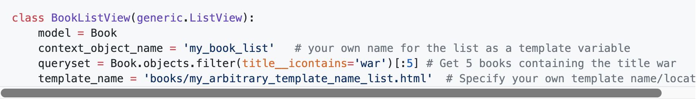
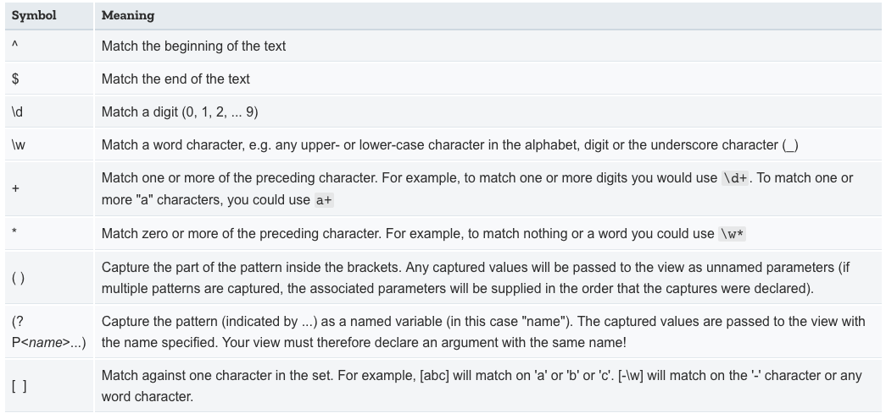
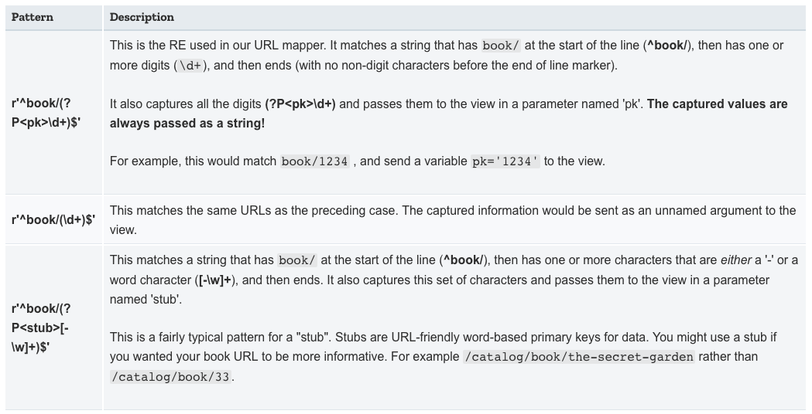
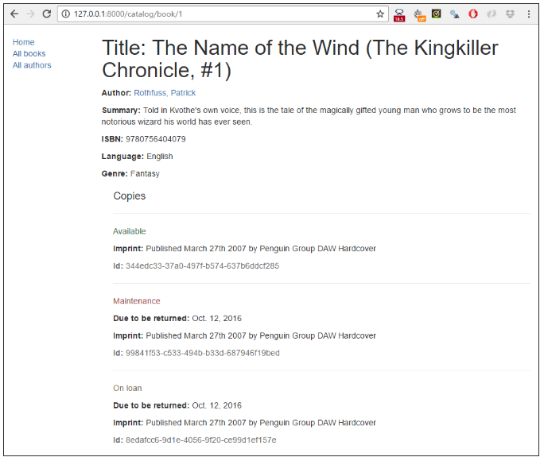
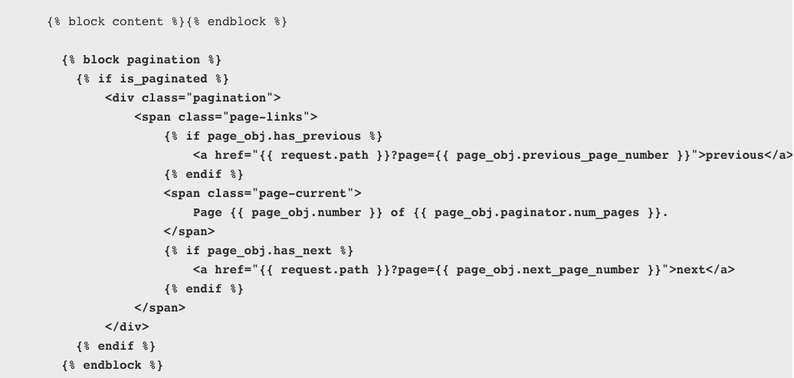

<!-- $theme: gaia -->

[Django Tutorial Part 6: Generic list and detail views](https://github.com/YoonJoon/AboutDjango/blob/master/genericViews.md)
=================================

<br>

##### Created by [이 윤 준](https://www.facebook.com/yoonjoon.lee) (yoonjoon.lee@gmail.com)

May, 2019

---

This extends our LocalLibrary website, adding list and detail pages for books and authors. Here we'll 
- learn about generic class-based views, and 
- show how they can reduce the amount of code we have to write for common use cases.
- go into URL handling in greater detail, showing how to perform basic pattern matching.

---

### Overview

We're going to complete the first version of the LocalLibrary website by adding list and detail pages for books and authors.

To be more precise, we'll show you how to implement the book pages, and get you to create the author pages yourself!

We'll still need to create URL maps, views, and templates. The main difference is that for the detail pages, we'll have the additional challenge of extracting information from patterns in the URL and passing it to the view.

---

For these pages, we're going to demonstrate a completely different type of view: generic class-based list and detail views. These can significantly reduce the amount of view code needed, making them easier to write and maintain.

---

### Book list page

<br>

The book list page will display a list of all the available book records in the page, accessed using the URL: <code>catalog/books/</code>.

The page will display a title and author for each record, with the title being a hyperlink to the associated book detail page.

The page will have the same structure and navigation as all other pages in the site, and we can, therefore, extend the base template (<b>base_generic.html</b>).

---

#### URL mapping

Open <b>/catalog/urls.py</b> and copy in the line. As for the index page, this <code>path()</code> function defines a pattern to match against the URL (<b>'books/'</b>), a view function that will be called if the URL matches (<code>views.BookListView.as_view()</code>), and a name for this particular mapping.

<font size="6">
  
```python
urlpatterns = [
    path('', views.index, name='index'),
    path('books/', views.BookListView.as_view(), name='books'),
]
```
</font>

The view will actually be called for the URL: /catalog/books/.

---

The view function has a different format than before — that's because this view will actually be implemented as a class. We will be inheriting from an existing generic view function that already does most of what we want this view function to do, rather than writing our own from scratch.

For Django class-based views we access an appropriate view function by calling the class method <code>as_view()</code>. This does all the work of creating an instance of the class, and making sure that the right handler methods are called for incoming HTTP requests.

---

#### View (class-based)

We could quite easily write the book list view as a regular function (just like our previous index view), which would query the database for all books, and then call render() to pass the list to a specified template. 

However, we're going to use a class-based generic list view (<code>ListView</code>) — a class that inherits from an existing view. Because the generic view already implements most of the functionality we need and follows Django best-practice, we will be able to create a more robust list view with less code, less repetition, and ultimately less maintenance.

---

Open <b>catalog/views.py</b>, and copy the code into the bottom of the file:

```python
from django.views import generic

class BookListView(generic.ListView):
    model = Book
```

The generic view will query the database to get all records for the specified model (<code>Book</code>) then render a template located at <b>/locallibrary/catalog/templates/catalog/book_list.html</b>. Within the template we can access the list of books with the template variable named <code>object_list</code> OR <code>book_list</code> (i.e. generically "<code><i>the_model_name_list</i></code>").

---

We can add attributes to change the default behaviour above. For example, we can specify another template file if we need to have multiple views that use this same model, or you might want to use a different template variable name if <code>book_list</code> is not intuitive for our particular template use-case. 

Possibly the most useful variation is to change/filter the subset of results that are returned — so instead of listing all books you might list top 5 books that were read by other users.



---

##### Overriding methods in class-based views

We can also override some of the class methods.

For example, we can override the <code>get_queryset()</code> method to change the list of records returned. This is more flexible than just setting the <code>queryset</code> attribute as we did in the preceding code fragment:

```python
class BookListView(generic.ListView):
    model = Book

    def get_queryset(self):
        # Get 5 books containing the title war
        return Book.objects.filter(title__icontains
            ='war')[:5] 
```

---

We might also override <code>get_context_data()</code> in order to pass additional context variables to the template. The fragment shows how to add a variable named "some_data" to the context.

```python
class BookListView(generic.ListView):
    model = Book

    def get_context_data(self, **kwargs):
        # Call the base implementation first to get the context
        context = super(BookListView, self).
            get_context_data(**kwargs)
        # Create any data and add it to the context
        context['some_data'] = 'This is just some data'
        return context
```

---

When doing this it is important to follow the pattern used above:

- First get the existing context from our superclass.
- Then add your new context information.
- Then return the new (updated) context.

---

#### Creating the List View template

Create the HTML file <b>/locallibrary/catalog/templates/catalog/book_list.html</b> and copy in the text. As discussed above, this is the default template file expected by the generic class-based list view.

Templates for generic views are just like any other templates. As with our <i>index</i> template, we extend our base template in the first line and then replace the block named content.

---

```html



  <h1>Book List</h1>
  
  <ul>
    
      <li>
        <a href="{{ book.get_absolute_url }}">
          {{ book.title }}</a> ({{book.author}})
      </li>
    
  </ul>
  
    <p>There are no books in the library.</p>
         

```

The view passes the context by default as <code>object_list</code> and <code>book_list</code> aliases; either will work.

---

##### Conditional execution

We use the <code>if</code>, <code>else</code>, and <code>endif</code> template tags to check whether the <code>book_list</code> has been defined and is not empty. If <code>book_list</code> is empty, then the <code>else</code> clause displays text explaining that there are no books to list. If <code>book_list</code> is not empty, then we iterate through the list of books.

```html

  <!-- code here to list the books -->

  <p>There are no books in the library.</p>

```
---

The condition above only checks for one case, but you can test on additional conditions using the elif template tag (e.g. <code></code>).

---

##### For loops

The template uses the for and <code>endfor</code> template tags to loop through the book list. Each iteration populates the <code>book</code> template variable with information for the current list item.

```html

  <li> 
    <!-- code here get information from each book item --> 
  </li>

```

---

Within the loop Django will also create other variables that we can use to track the iteration. For example, we can test the <code>forloop.last</code> variable to perform conditional processing the last time that the loop is run.

---

##### Accessing variables

The code inside the loop creates a list item for each book that shows both the title and the author.

```html
<a href="{{ book.get_absolute_url }}">
  {{ book.title }}</a> ({{book.author}})
```

We access the <i>fields</i> of the associated book record using the "dot notation", where the text following the book item is the field name.

We can also call functions in the model from within our template — we call <code>Book.get_absolute_url()</code> to get an URL we could use to display the associated detail record. This works does not have any arguments.

---

##### Update the base template

Open the base template (<b>/locallibrary/catalog/templates/base_generic.html</b>) and insert <b></b> into the URL link for <b>All books</b>. This will enable the link in all pages (we can successfully put this in place now that we've created the "books" URL mapper).

```html
<li><a href="">Home</a></li>
<li><a href="">All books</a></li>
<li><a href="">All authors</a></li>
```

---

#### What does it look like?

The book detail page will display information about a specific book, accessed using the URL <code>catalog/book/\<id></code> (where <code>\<id></code> is the primary key for the book). 

In addition to fields in the <code>Book</code> model (author, summary, ISBN, language, and genre), we'll also list the details of the available copies (<code>BookInstances</code>) including the status, expected return date, imprint, and id. This will allow our readers not just to learn about the book, but also to confirm whether/when it is available.

---

### Book detail page

<br>

The book detail page will display information about a specific book, accessed using the URL <code>catalog/book/\<id></code> (where <code>\<id></code> is the primary key for the book). In addition to fields in the <code>Book</code> model (author, summary, ISBN, language, and genre), we'll also list the details of the available copies (<code>BookInstances</code>) including the status, expected return date, imprint, and id. 
  
This will allow us not just to learn about the book, but also to confirm whether/when it is available.

---

#### URL mapping

Open <b>/catalog/urls.py</b> and add the '<b>book-detail</b>' URL mapper. This <code>path()</code> function defines a pattern, associated generic class-based detail view, and a name.

```python
urlpatterns = [
    path('', views.index, name='index'),
    path('books/', views.BookListView.as_view(), name='books'),
    path(
        'book/<int:pk>', 
        views.BookDetailView.as_view(), 
        name='book-detail'),
]
```

---

For the <i>book-detail</i> path the URL pattern uses a special syntax to capture the specific id of the book that we want to see. The syntax is very simple: angle brackets define the part of the URL to be captured, enclosing the name of the variable that the view can use to access the captured data. We can optionally precede the variable name with a converter specification that defines the type of data (int, str, slug, uuid, path).

In this case we use '<code>\<int:pk></code>' to capture the book id, which must be a specially formatted string and pass it to the view as a parameter named <code>pk</code>. This is the id that is being used to store the book uniquely in the database, as defined in the Book Model.

---

##### Advanced path matching/regular expression primer

The pattern matching provided by <code>path()</code> is simple and useful for the cases where we just want to capture <i>any</i> string or integer. If we need more refined filtering (for example, to filter only strings that have a certain number of characters) then we can use the <code>re_path()</code> method.

---

This method is used just like <code>path()</code> except that it allows you to specify a pattern using a Regular expression. 

```python
re_path(
    r'^book/(?P<pk>\d+)$', 
    views.BookDetailView.as_view(), 
    name='book-detail')
```

<i>Regular expressions</i> are an incredibly powerful pattern mapping tool. They are, frankly, quite unintuitive and scary for beginners.

---

The first thing to know is that regular expressions should usually be declared using the raw string literal syntax (i.e. they are enclosed as shown: <b>r'\<your regular expression text goes here></b>').
  


---

A few real examples of patterns:



We can capture multiple patterns in the one match, and hence encode lots of different information in a URL.

---

##### Passing additional options in your URL maps

We can declare and pass additional options to the view. The options are declared as a dictionary that we pass as the third un-named argument to the <code>path()</code> function. This approach can be useful if we want to use the same view for multiple resources, and pass data to configure its behaviour in each case.

```python
path(
    'url/', views.my_reused_view, 
    {'my_template_name': 'some_path'}, name='aurl'),
path(
    'anotherurl/', views.my_reused_view, 
    {'my_template_name': 'another_path'}, name='anotherurl'),
```

---

#### View(class-based)

Open <b>catalog/views.py</b>, and copy the code into the bottom of the file:

```python
class BookDetailView(generic.DetailView):
    model = Book
```

We create a template called <b>/locallibrary/catalog/templates/catalog/book_detail.html</b>, and the view will pass it the database information for the specific<code>Book</code> record extracted by the URL mapper. Within the template we can access the list of books with the template variable named <code>object</code> OR <code>book</code> (i.e. generically "<code><i>the\_model\_name</i></code>").

---

We can change the template used and the name of the context object used to reference the book in the template. We can also override methods to, for example, add additional information to the context.

---

##### What happens if the record doesn't exist?

If a requested record does not exist then the generic class-based detail view will raise an <code>Http404</code> exception automatically — in production, this will automatically display an appropriate "resource not found" page, which we have to customise.

The code fragment demonstrates how we would implement the class-based view as a function if we were not using the generic class-based detail view.

---


```python
def book_detail_view(request, primary_key):
    try:
        book = Book.objects.get(pk=primary_key)
    except Book.DoesNotExist:
        raise Http404('Book does not exist')
    
    return render(
        request, 
        'catalog/book_detail.html', 
        context={'book': book})
```

The view first tries to get the specific book record from the model. If this fails the view should raise an <code>Http404</code> exception to indicate that the book is "not found". The final step is then to call <code>render()</code> with the template name and the book data in the <cpde>context</code> parameter.


---

Alternatively, we can use the <code>get_object_or_404()</code> function as a shortcut to to raise an <code>Http404</code> exception if the record is not found.

```python
from django.shortcuts import get_object_or_404

def book_detail_view(request, primary_key):
    book = get_object_or_404(Book, pk=primary_key)
    return render(
        request, 
        'catalog/book_detail.html', 
        context={'book': book})
```

---

#### Creating the Detail View template

Create the HTML file <b>/locallibrary/catalog/templates/catalog/book_detail.html</b> with the content. This is the default template file name expected by the generic class-based detail view (for a model named <code>Book</code> in an application named <code>catalog</code>).

---

```html



  <h1>Title: {{ book.title }}</h1>

  <p><strong>Author:</strong> 
    <a href="">{{ book.author }}</a>
  </p> <!-- author detail link not yet defined -->
  <p><strong>Summary:</strong> {{ book.summary }}</p>

  <p><strong>ISBN:</strong> {{ book.isbn }}</p> 
  <p><strong>Language:</strong> {{ book.language }}</p>  
  <p><strong>Genre:</strong> 
     
      {{ genre }}
      , 
      
    
  </p>  
```

---

```html
  <div style="margin-left:20px;margin-top:20px">
    <h4>Copies</h4>

    
      <hr>
      <p class="
         text-success
         text-danger
           text-warning
        "> {{ copy.get_status_display }}
      </p>
      
      
        <p>
          <strong>Due to be returned:</strong> 
          {{copy.due_back}}
        </p>
      
      <p><strong>Imprint:</strong> {{copy.imprint}}</p>
      <p class="text-muted"><strong>Id:</strong> {{copy.id}}</p>
    
  </div>

```

---

- We extend our base template and override the "content" block.
- We use conditional processing to determine whether or not to display specific content.
- We use <code>for</code> loops to loop through lists of objects.
- We access the context fields using the dot notation (because we've used the detail generic view, the context is named <code>book</code>; we could also use "<code>object</code>")

---

The one interesting thing is the function <code>book.bookinstance_set.all()</code>. This method is "automagically" constructed by Django in order to return the set of <code>BookInstance</code> records associated with a particular <code>Book</code>.

```html

  <!-- code to iterate across each copy/instance of a book -->

```

---

This method is needed because we declare a <code>ForeignKey</code> (one-to many) field in only the "one" side of the relationship. 

Since we don't do anything to declare the relationship in the other ("many") models, it doesn't have any field to get the set of associated records.

Django constructs an appropriately named "reverse lookup" function that we can use. The name of the function is constructed by lower-casing the model name where the <code>ForeignKey</code> was declared, followed by <code>\_set</code> (i.e. so the function created in <code>Book</code> is <code>bookinstance_set()</code>).

---

### What does it look like?

We should have created everything needed to display both the book list and book detail pages. Run the server and open your browser to http://127.0.0.1:8000/.

Click the All books link to display the list of books. 


---

Then click a link to one of your books. If everything is set up correctly, you should see something like the creenshot.



---

### Pagination

If we get into the tens or hundreds of records the page will take progressively longer to load (and have far too much content to browse sensibly). 

The solution to this problem is to add pagination to our list views, reducing the number of items displayed on each page. 

Django has excellent inbuilt support for pagination. Even better, this is built into the generic class-based list views so we don't have to do very much to enable it!

---

#### Views

Open <b>catalog/views.py</b>, and add the paginate_by line.

```python
class BookListView(generic.ListView):
    model = Book
    paginate_by = 10
```

With this addition, as soon as we have more than 10 records the view will start paginating the data it sends to the template. The different pages are accessed using GET parameters — to access page 2 you would use the URL: <code>catalog/books/?page=2</code>.

---

#### Templates

Now that the data is paginated, we need to add support to the template to scroll through the results set. Because we might want to do this in all list views, we'll do this in a way that can be added to the base template. 

Open <b>/locallibrary/catalog/templates/base_generic.html</b> and copy in the pagination block below our content block. The code first checks if pagination is enabled on the current page. If so then it adds next and previous links as appropriate (and the current page number). 

---



---

The <code>page_obj</code> is a Paginator object that will exist if pagination is being used on the current page. It allows us to get all the information about the current page, previous pages, how many pages there are, etc. 

We use <code>{{ request.path }}</code> to get the current page URL for creating the pagination links. This is useful because it is independent of the object that we're paginating.

---

#### What does it look like?

The screenshot shows what the pagination looks like, then we can test it more easily by lowering the number specified in the <code>paginate_by</code> line in your <b>catalog/views.py</b> file. To get the result we changed it to <code>paginate_by = 2</code>.

The pagination links are displayed on the bottom, with next/previous links.


---

### Challenge yourself

The challenge is to create the author detail and list views required to complete the project. These should be made available at the following URLs:

- <code>catalog/authors/</code> — The list of all authors.
- <code>catalog/author/<i>\<id></i></code> — The detail view for the specific author with a primary key field named <code><i>\<id></i></code>

The code required for the URL mappers and the views should be virtually identical to the <code>Book</code> list and detail views we created above. The templates will be different but will share similar behaviour.

---

Your pages should look something like the screenshots.


