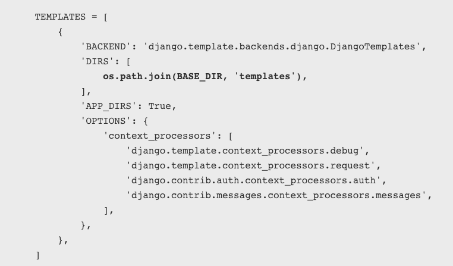

<!-- $theme: gaia -->

[Django Tutorial Part 5: Creating our home page](https://github.com/YoonJoon/AboutDjango/blob/master/homePage.md)
=================================

<br>

##### Created by [이 윤 준](https://www.facebook.com/yoonjoon.lee) (yoonjoon.lee@gmail.com)

May, 2019

---

We're now ready to add the code that displays our first complete page — a home page for the <i>LocalLibrary</i> website. The home page will show the number of records we have for each model type and provide sidebar navigation links to our other pages. Along the way we'll gain practical experience in writing basic URL maps and views, getting records from the database, and using templates.

---

### Overview

<br>

After we defined our models and created some initial library records to work with, it's time to write the code that presents that information to users. The first thing we need to do is determine what information we want to display in our pages, and define the URLs to use for returning those resources. Then we'll create a URL mapper, views, and templates to display the pages. 

---

As we already implemented the model, the main components we'll create are:

- URL mappers to forward the supported URLs (and any information encoded in the URLs) to the appropriate view functions.
- View functions to get the requested data from the models, create HTML pages that display the data, and return the pages to the user to view in the browser.
- Templates to use when rendering data in the views.

---


---

### Defining the resource URLs

As this version of <i>LocalLibrary</i> is essentially read-only for end users, we just need to provide a landing page for the site (a home page), and pages that display list and detail views for books and authors. 

---

The URLs that we'll need for our pages are:

- catalog/ — The home (index) page.
- catalog/books/ — A list of all books.
- catalog/authors/ — A list of all authors.
- catalog/book/<id> — The detail view for a particular book, with a field primary key of <id> (the default). 
- catalog/author/<id> — The detail view for the specific author with a primary key field of <id>. 

---

The first three URLs will return the index page, books list, and authors list. These URLs do not encode any additional information, and the queries that fetch data from the database will always be the same. 

By contrast the final two URLs will display detailed information about a specific book or author.  These URLs encode the identity of the item to display (represented by <code>\<id></code> above). The URL mapper will extract the encoded information and pass it to the view, and the view will dynamically determine what information to get from the database.

---

### Creating the index page

The first page we'll create is the index page (catalog/). The index page will include some static HTML, along with generated "counts" of different records in the database. To make this work we'll create a URL mapping, a view, and a template. 

---

#### URL mapping

When we created the skeleton website, we updated the <b>locallibrary/urls.py</b> file to ensure that whenever an URL that starts with <code>catalog/</code>  is received, the <i>URLConf</i> module <code>catalog.urls</code> will process the remaining substring.

The following code snippet from <b>locallibrary/urls.py</b> includes the <code>catalog.urls</code> module:

```python
urlpatterns += [
    path('catalog/', include('catalog.urls')),
]
```

---

We also created a placeholder file for the <i>URLConf</i> module, named <b>/catalog/urls.py</b>. Add the lines to that file: 

```python
urlpatterns = [
    path('', views.index, name='index'),
]
```

The <code>path()</code> function defines the following:

- A URL pattern, which is an empty string: <code>''</code>.
- A view function that will be called if the URL pattern is detected: <code>views.index</code>,  which is the function named <code>index()</code> in the <b>views.py</b> file. 

---

The <code>path()</code> function also specifies a <code>name</code> parameter, which is a unique identifier for this particular URL mapping. You can use the name to "reverse" the mapper, i.e.  to dynamically create a URL that  points to the resource that the mapper is designed to handle.  For example, we can use the name parameter to link to our home page from any other page  by adding the link in a template:

```html
<a href="">Home</a>
```

---

#### View (function-based)

A view is a function that processes an HTTP request, fetches the required data from the database, renders the data in an HTML page using an HTML template, and then returns the generated HTML in an HTTP response to display the page to the user. 

The index view follows this model — it fetches information about the number of <code>Book</code>, <code>BookInstance</code>, available <code>BookInstance</code> and <code>Author</code> records that we have in the database, and passes that information to a template for display.

---

Open <b>catalog/views.py</b> and note that the file already imports the render() shortcut function to generates HTML file using a template and data: 

```python
from django.shortcuts import render

# Create your views here.
```

Paste the following lines at the bottom of the file:

```python
from catalog.models import Book, Author
from catalog.models import BookInstance, Genre

def index(request):
    """View function for home page of site."""

```

---

```python
    # Generate counts of some of the main objects
    num_books = Book.objects.all().count()
    num_instances = BookInstance.objects.all().count()
    
    # Available books (status = 'a')
    num_instances_available = BookInstance.objects.filter(
        status__exact='a').count()
    
    # The 'all()' is implied by default.    
    num_authors = Author.objects.count()
    
    context = {
        'num_books': num_books,
        'num_instances': num_instances,
        'num_instances_available': num_instances_available,
        'num_authors': num_authors,
    }

    """ Render the HTML template index.html 
        with the data in the context variable"""
    return render(request, 'index.html', context=context)
```

---

The first line imports the model classes that we'll use to access data in all our views.

The first part of the view function fetches the number of records using the <code>objects.all()</code> attribute on the model classes. It also gets a list of <code>BookInstance</code> objects that have a value of 'a' (Available) in the status field.

At the end of the view function we call the <code>render()</code> function to create an HTML page and return the page as a response. This shortcut function wraps a number of other functions to simplify a very common use case.

---

The <code>render()</code> function accepts the following parameters:

- the original <code>request</code> object, which is an <code>HttpRequest</code>.
- an HTML template with placeholders for the data.
- a <code>context</code> variable, which is a Python dictionary, containing the data to insert into the placeholders. 

---

#### Template

A template is a text file that defines the structure or layout of a file (such as an HTML page), it uses placeholders to represent actual content. 

Django will automatically look for templates in a directory named '<b>templates</b>' in your application. For example, in the index view that we just added, the <code>render()</code> function will expect to find the file <i><b>index.html</b></i> in <b>/locallibrary/catalog/templates/</b> and will raise an error if the file is not present.

We can check this by saving the previous changes and accessing <code>127.0.0.1:8000</code> in our browser.

---

##### Extending templates

The index template will need standard HTML markup for the head and body, along with navigation sections to link to the other pages of the site, and to sections that display introductory text and book data.

Much of the HTML and navigation structure will be the same in every page of our site. Instead of duplicating boilerplate code on every page, you can use the Django templating language to declare a base template, and then extend it to replace just the bits that are different for each specific page. 

---

The code snippet is a sample base template from a <b>base_generic.html</b> file. We'll be creating the template for LocalLibrary shortly. The sample below includes common HTML with sections for a title, a sidebar, and main contents marked with the named <code>block</code> and <code>endblock</code> template tags. We can leave the blocks empty, or include default content to use when rendering pages derived from the template.

---

```html
<!DOCTYPE html>
<html lang="en">
<head>
  <title>Local Library</title>
</head>
<body>
  <!-- insert default navigation text for every page -->
  <!-- default content text (typically empty) -->
</body>
</html>
```

When defining a template for a particular view, we first specify the base template using the <code>extends</code> template tag. Then we declare what sections from the template we want to replace (if any), using <code>block/endblock</code> sections as in the base template. 

---

The code snippet shows how to use the <code>extends</code> template tag and override the <code>content</code> block. The generated HTML will include the code and structure defined in the base template, including the default content you defined in the title block, but the new content block in place of the default one.

```html



  <h1>Local Library Home</h1>
  <p>Welcome to LocalLibrary, a website developed by <em>Mozilla Developer Network</em>!</p>

```

---

##### The LocalLibrary base template

We will use the code snippet as the base template for the <i>LocalLibrary</i> website. It contains some HTML code and defines blocks for <code>title</code>, <code>sidebar</code>, and <code>content</code>. We have a default title and a default sidebar with links to lists of all books and authors, both enclosed in blocks to be easily changed in the future.

Create a new file <b>base_generic.html</b> in <b>/locallibrary/catalog/templates/</b> and paste the code to the file:

---

```html
<!DOCTYPE html>
<html lang="en">
<head>
  
    <title>Local Library</title>
  
  <meta charset="utf-8">
  <meta name="viewport" 
        content="width=device-width, initial-scale=1">
  <link rel="stylesheet"
        href="https://stackpath.bootstrapcdn.com/bootstrap/4.1.3/css/bootstrap.min.css"
        integrity="sha384-MCw98/SFnGE8fJT3GXwEOngsV7Zt27NXFoaoApmYm81iuXoPkFOJwJ8ERdknLPMO" 
        crossorigin="anonymous">
  
  <!-- Add additional CSS in static file -->
  
  <link rel="stylesheet" 
        href="">
</head>
```

---

```html
<body>
  <div class="container-fluid">
    <div class="row">
      <div class="col-sm-2">
      
        <ul class="sidebar-nav">
          <li><a href="">Home</a></li>
          <li><a href="">All books</a></li>
          <li><a href="">All authors</a></li>
        </ul>
     
      </div>
      <div class="col-sm-10 ">
        
      </div>
    </div>
  </div>
</body>
</html>
```

---

The template includes CSS from Bootstrap to improve the layout and presentation of the HTML page. Using Bootstrap (or another client-side web framework) is a quick way to create an attractive page that displays well on different screen sizes.

The base template also references a local css file (<b>styles.css</b>) that provides additional styling. Create a <b>styles.css</b> file in <b>/locallibrary/catalog/static/css/</b> and paste the code in the file:

```css
.sidebar-nav {
    margin-top: 20px;
    padding: 0;
    list-style: none;
}
```

---

##### The index template

Create a new HTML file <b>index.html</b> in <b>/locallibrary/catalog/templates/</b> and paste the code in the file. This code extends our base template on the first line, and then replaces the default content block for the template. 

---

```html



  <h1>Local Library Home</h1>
  <p>Welcome to LocalLibrary, a website developed by <em>Mozilla Developer Network</em>!</p>
  <h2>Dynamic content</h2>
  <p>The library has the following record counts:</p>
  <ul>
    <li><strong>Books:</strong> {{ num_books }}</li>
    <li><strong>Copies:</strong> {{ num_instances }}</li>
    <li><strong>Copies available:</strong> {{ num_instances_available }}</li>
    <li><strong>Authors:</strong> {{ num_authors }}</li>
  </ul>

```

In the <i>Dynamic content</i> section we declare placeholders (<i>template variables</i>) for the information from the view that we want to include. 

---

The important thing to note here is that variables are named with the <i>keys</i> that we pass into the <code>context</code> dictionary in the <code>render() </code>function of our view. Variables will be replaced with their associated <i>values</i> when the template is rendered.  

```python
    context = {
        'num_books': num_books,
        'num_instances': num_instances,
        'num_instances_available': num_instances_available,
        'num_authors': num_authors,
        }

    return render(request, 'index.html', context=context)
```

---

##### Referencing static files in templates

Our project is likely to use static resources, including JavaScript, CSS, and images. Because the location of these files might not be known (or might change), Django allows us to specify the location in your templates relative to the <code>STATIC_URL</code> global setting. The default skeleton website sets the value of <code>STATIC_URL</code> to '<code>/static/</code>', but we might choose to host these on a content delivery network or elsewhere.

Within the template you first call the <code>load</code> template tag specifying "static" to add the template library. You can then use the <code>static</code> template tag and specify the relative URL to the required file.

---

```html
<!-- Add additional CSS in static file --> 
 
<link rel="stylesheet" 
      href="">
```

You can add an image into the page in a similar way.

```html
% load static %}

```

---

##### Linking URL

The base template below introduced the <code>url</code> template tag.

```html
<li><a href="">Home</a></li>
```

This tag accepts the name of a <code>path()</code> function called in our urls.py and the values for any arguments that the associated view will receive from that function, and returns a URL that we can use to link to the resource.

---

##### Configuring where to find the templates

We need to point Django to search for our templates in the templates folder. To do that, add the templates dir to the TEMPLATES object by editing the <b>settings.py</b> file in the code sample:



---

### What does it look like?

<br>

At this point we have created all required resources to display the index page. Run the server and open http://127.0.0.1:8000/ in your browser.


---

### Challenge yourself

Here are a couple of tasks to test your familiarity with model queries, views, and templates. 

1. The LocalLibrary base template includes a <code>title</code> block. Override this block in the index template and create a new title for the page.
2. Modify the view to generate counts for <i>genres</i> and <i>books</i> that contain a particular word (case insensitive), and pass the results to the <code>context</code>. You accomplish this in a similar way to creating and using <code>num_books</code> and <code>num_instances_available</code>. Then update the index template to include these variables.

