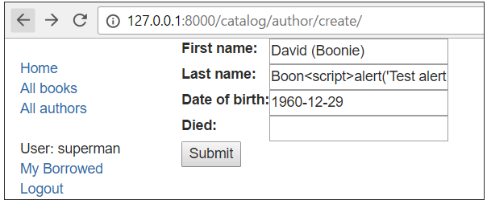

<!-- $theme: gaia -->

[Django web application security](https://github.com/YoonJoon/AboutDjango/blob/master/webApplicationSecurity.md)
=================================

<br>

##### Created by [이 윤 준](https://www.facebook.com/yoonjoon.lee) (yoonjoon.lee@gmail.com)

June, 2019

---

Protecting user data is an essential part of any website design. We previously explained some of the more common security threats in the article Web security — these slides provides a practical demonstration of how Django's in-built protections handle such threats.

---

### Overview

The Website security topic provides an overview of what website security means for server-side design, and some of the more common threats that we may need to protect against. 

One of the key messages is that almost all attacks are successful when the web application trusts data from the browser.

The good news for Django users is that many of the more common threats are handled by the framework. 

---

The <u>Security in Django</u> (Django docs) article explains Django's security features and how to secure a Django-powered website.

---

### Common threats/protections

We'll demonstrate just a few of the security features in the context of our Django <i>LocalLibrary</i> tutorial.

---

#### Cross site scripting (XSS)

XSS is a term used to describe a class of attacks that allow an attacker to inject client-side scripts through the website into the browsers of other users. 

This is usually achieved by storing malicious scripts in the database where they can be retrieved and displayed to other users, or by getting users to click a link that will cause the attacker’s JavaScript to be executed by the user’s browser.

Django's template system protects us against the majority of XSS attacks by escaping specific characters that are "dangerous" in HTML. 

---

We can demonstrate this by attempting to inject some JavaScript into our LocalLibrary website using the Create-author form we set up in <i>Django Tutorial Part 9: Working with forms</i>.

<font size="5">
<ol>
  <li>Start the website using the development server (<code>python3 manage.py runserver</code>).</li>
  <li>Open the site in our local browser and login to our superuser account.</li>
  <li>Navigate to the author-creation page (which should be at URL:<code>http://127.0.0.1:8000/catalog/author/create/</code>).</li>
  <li>Enter names and date details for a new user, and then append the following text to the Last Name field: <code>&lt;script&gt;alert(&#39;Test alert&#39;);&lt;/script&gt;</code></li>
</ol>
  
---



<ol start=5>
  <li>Press <b>Submit</b> to save the record.</li>
  <li>When you save the author it will be displayed as shown below. Because of the XSS protections the <code>alert()</code> should not be run. Instead the script is displayed as plain text.</li>
</ol>


</font>

---

If you view the page HTML source code, you can see that the dangerous characters for the script tags have been turned into their harmless escape code equivalents (e.g. <code>></code> is now <code>&gt;</code>).

<font size="5">
  
```html
<h1>
  Author: Boon&lt;script&gt;alert(&#39;Test alert&#39;);&lt;/script&gt;, 
  David (Boonie) 
</h1>
```
</font>

Using Django templates protects us against the majority of XSS attacks. 

However it is possible to turn off this protection, and the protection isn't automatically applied to all tags that wouldn't normally be populated by user input.

---

It is also possible for XSS attacks to originate from other untrusted source of data, such as cookies, Web services or uploaded files (whenever the data is not sufficiently sanitized before including in a page). 

If we're displaying data from these sources, then we may need to add our own sanitisation code.

---

#### Cross site request forgery (CSRF) protection

CSRF attacks allow a malicious user to execute actions using the credentials of another user without that user’s knowledge or consent. For example consider the case where we have a hacker who wants to create additional authors for our LocalLibrary.

In order to do this, they might create an HTML file like the one below, which contains an author-creation form (like the one we used in the previous section) that is submitted as soon as the file is loaded. 

---

They would then send the file to all the Librarians and suggest that they open the file (it contains some harmless information, honest!). 

If the file is opened by any logged in librarian, then the form would be submitted with their credentials and a new author would be created.

---

<font size="5">

```html
<html>
<body onload='document.EvilForm.submit()'>

<form action="http://127.0.0.1:8000/catalog/author/create/" method="post" name='EvilForm'>
  <table>
    <tr><th><label for="id_first_name">First name:</label></th>
      <td><input id="id_first_name" maxlength="100" 
             name="first_name" type="text" value="Mad" required /></td></tr>
    <tr><th><label for="id_last_name">Last name:</label></th>
      <td><input id="id_last_name" maxlength="100" 
                 name="last_name" type="text" value="Man" required /></td></tr>
    <tr><th><label for="id_date_of_birth">Date of birth:</label></th>
      <td><input id="id_date_of_birth" 
                 name="date_of_birth" type="text" /></td></tr>
    <tr><th><label for="id_date_of_death">Died:</label></th>
      <td><input id="id_date_of_death" 
                 name="date_of_death" type="text" value="12/10/2016" /></td></tr>
  </table>
  <input type="submit" value="Submit" />
</form>

</body>
</html>
```

</font>

---

Run the development web server, and log in with your superuser account. 

Copy the text above into a file and then open it in the browser. You should get a CSRF error, because Django has protection against this kind of thing.

The way the protection is enabled is that we include the <code></code> template tag in our form definition. 

This token is then rendered in our HTML, with a value that is specific to the user on the current browser.

<font size="5">

```html
<input type='hidden' name='csrfmiddlewaretoken' 
      value='0QRWHnYVg776y2l66mcvZqp8alrv4lb8S8lZ4ZJUWGZFA5VHrVfL2mpH29YZ39PW' />
```

</font>

---

Django generates a user/browser specific key and will reject forms that do not contain the field, or that contain an incorrect field value for the user/browser.

To use this type of attack the hacker now has to discover and include the CSRF key for the specific target user. They also can't use the "scattergun" approach of sending a malicious file to all librarians and hoping that one of them will open it, since the CSRF key is browser specific.

Django's CSRF protection is turned on by default. We should always use the <code></code> template tag in our forms and use <code>POST</code> for requests that might change or add data to the database.

---

#### Other protections

Django also provides other forms of protection:

<font size="6">
<b>SQL injection protection</b>
<p style="margin-left:5%; ">SQL injection vulnerabilities enable malicious users to execute arbitrary SQL code on a database, allowing data to be accessed, modified, or deleted irrespective of the user's permissions. In almost every case you'll be accessing the database using Django’s querysets/models, so the resulting SQL will be properly escaped by the underlying database driver. If we do need to write raw queries or custom SQL then we'll need to explicitly think about preventing SQL injection.</p>

---

<b>Clickjacking protection</b>
<p style="margin-left:5%; ">In this attack a malicious user hijacks clicks meant for a visible top level site and routes them to a hidden page beneath. This technique might be used, for example, to display a legitimate bank site but capture the login credentials in an invisible <code>&lt;iframe></code>controlled by the attacker. Django contains <u>clickjacking protection</u> in the form of the <u>X-Frame-Options middleware</u> which, in a supporting browser, can prevent a site from being rendered inside a frame.</p>

---

<b>Enforcing SSL/HTTPS</b>
<p style="margin-left:5%; ">
SSL/HTTPS can be enabled on the web server in order to encrypt all traffic between the site and browser, including authentication credentials that would otherwise be sent in plain text (enabling HTTPS is highly recommended). If HTTPS is enabled then Django provides a number of other protections we can use:</p>


---

- <code>SECURE_PROXY_SSL_HEADER</code> can be used to check whether content is secure, even if it is incoming from a non-HTTP proxy.
- <code>SECURE_SSL_REDIRECT</code> is used to redirect all HTTP requests to HTTPS.
- Use <code>HTTP Strict Transport Security</code> (HSTS). This is an HTTP header that informs a browser that all future connections to a particular site should always use HTTPS. Combined with redirecting HTTP requests to HTTPS, this setting ensures that HTTPS is always used after a successful connection has occurred. HSTS may either be configured with <code>SECURE_HSTS_SECONDS</code> and <code>SECURE_HSTS_INCLUDE_SUBDOMAINS</code> or on the Web server.
- Use ‘secure’ cookies by setting <code>SESSION_COOKIE_SECURE</code> and <code>CSRF_COOKIE_SECURE</code> to <code>True</code>. This will ensure that cookies are only ever sent over HTTPS.

---

<b>Host header validation</b>
<p style="margin-left:5%; ">
  Use <code>ALLOWED_HOSTS</code> to only accept requests from trusted hosts.</p>

</font>

There are many other protections, and caveats to the usage of the above mechanisms. 

While this has given us an overview of what Django offers, we should still read the Django security documentation.


          