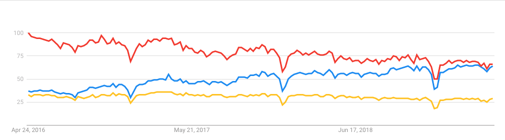

<!-- $theme: gaia -->

About Python
============

###### Created by [이 윤 준](https://www.facebook.com/yoonjoon.lee) (yoonjoon.lee@gmail.com)

May, 2019

---

---

### Python?

-	네덜란드 프로그래머 Guido van Rossum이 1989년 창안한 범용 프로그래밍 언어
-	Python Software Foundation이 개발을 주도하는 자유 공개 소스 소프트웨어(free and open source software)

---

Trends in Programming Language
------------------------------

---

Characteristics
---------------

###### 빠른 응용 프로그램 개발에 적합하도록 상대적으로 작은 핵심 부분과 수많은 라이브러리들로 구성된 고급 프로그래밍 언어

-	Procedural (절차적)
-	Object Oriented (객체지향)
-	Functional (함수적)

###### Interpreter (인터프리터)

---

### Syntax

###### 문법의 특성은 간단하고

 

### Programming

###### 작성된 코드는 쉽게 이해하고 기억할 수 있는 장점

---

### Application Area

-	인공지능
-	컴퓨터 통신
-	웹 페이지 개발
-	사용자 인터페이스 (user interface)
-	게임
-	멀티미디어, 데이터 처리, 정보 보호, 등

Google, Dropbox, Reddit, YouTube, Walt Disney Animation, 등

---

### See also

 

[Python에 대하여](https://github.com/YoonJoon/ProgramminginPython/blob/master/Part1/about_Python.ipynb)
